# FIDWAC v2 - Advanced Lossy DCT Compression for Geospatial Data

## Table of Contents

- [Abstract](#abstract)
- [System Requirements and Installation](#system-requirements-and-installation)
  - [System Requirements](#system-requirements)
  - [Full Installation Guide](#full-installation-guide)
- [Running FIDWAC v2](#running-fidwac-v2)
  - [GUI (Graphical User Interface)](#gui-graphical-user-interface)
  - [Command Line (CLI)](#command-line-cli)
  - [Compression Parameters](#compression-parameters)
- [Quick Verification](#quick-verification)
- [1. Introduction and Theoretical Context](#1-introduction-and-theoretical-context)
  - [1.1 Mathematical Basis of the DCT Transform](#11-mathematical-basis-of-the-dct-transform)
  - [1.2 Compression Optimization Problem](#12-compression-optimization-problem)
- [2. Main Differences from FIDWaC v1](#2-main-differences-from-fidwac-v1)
- [3. Data Flow Diagrams](#3-data-flow-diagrams)
- [4. VLQ (Variable-Length Quantity) Encoding](#4-vlq-variable-length-quantity-encoding)
- [5. Numba JIT Acceleration](#5-numba-jit-acceleration)
- [6. Methodology for Predicting the Optimal DCT Chain Length](#6-methodology-for-predicting-the-optimal-dct-chain-length)
- [7. Search Algorithm for the Optimal Length](#7-search-algorithm-for-the-optimal-length)
- [8. Data Encoding Modes After DCT](#8-data-encoding-modes-after-dct)
- [9. Data Preparation Methods](#9-data-preparation-methods)
- [10. Output File Format](#10-output-file-format)
- [11. System Implementation](#11-system-implementation)
- [12. Summary of FIDWAC v2 Innovations](#12-summary-of-fidwac-v2-innovations)
- [13. Performance Test Results - FIDWAC v2 vs SZ3](#13-performance-test-results---fidwac-v2-vs-sz3)
- [License and Citation](#license-and-citation)
- [Bibliography](#bibliography)

---

## Abstract

FIDWAC v2 (Fast Inverse Distance Weighting and Compression, version 2) is the next development version of the original FIDWaC system (https://github.com/ZSIP/FIDWaC.git). As in the first version, the system implements lossy compression of raster data with a guaranteed maximum approximation error, using a two-dimensional Discrete Cosine Transform (2D-DCT) and adaptive selection of the number of retained coefficients.

Version 2 adds Numba JIT acceleration for key mathematical operations, faster block indexing, a hybrid search algorithm with incremental error reconstruction, a graphical user interface (GUI), and five dedicated processing paths for UINT8/INT8/FLOAT data:

1. **DCT compression for elevation data (float32/int16)** - intended for single-channel continuous data such as DEM/DTM models or IDW interpolation grids. It guarantees a maximum error <= epsilon in the original units (metres, centimetres). It uses a DC Median predictor with separate DC/AC streams (`cm=3`).
2. **Standard DCT compression (uint8 accuracy)** - intended for single-channel images such as LiDAR intensity, hillshade, or individual raster bands. It guarantees a maximum error <= epsilon in grayscale values (0-255), without colour-space conversion (`cm=5`).
3. **Per-block YCbCr with cascading multipliers** - intended for multi-channel RGB imagery in accuracy mode. It guarantees a maximum error <= epsilon in RGB space by using block-wise fitting of coefficients (`cm=6`).
4. **TurboJPEG (SIMD)** - an alternative fast RGB path without accuracy mode, based on JPEG quality settings. It uses standard JPEG compression through libjpeg-turbo and does not provide a formal maximum-approximation-error guarantee. This is a very fast file-packing method, but it can introduce excessive uncontrolled noise. It does not provide a single-channel mode or a multi-channel mode for more than 3 RGB channels (`cm=1` with `meta.msgpack`).
5. **Lossless compression** - intended for uint8 data requiring exact reconstruction (`max error = 0`). It uses a PNG Sub filter followed by zlib deflate. It does not provide a single-channel mode or a multi-channel mode for more than 3 RGB channel (`cm=4`).

**FIDWAC advantage:** Unlike typical array compressors such as ZFP or SZ3, FIDWAC stores georeferencing parameters and raster metadata together with the compressed data. The archive includes the information required to reconstruct a ready-to-use GeoTIFF: CRS, affine transform, raster dimensions, NoData information, special-value masks, and compression parameters. Decompression therefore restores the spatially referenced GeoTIFF directly, without manual georeference reconstruction.

---

## System Requirements and Installation

### System Requirements

#### Operating Systems

- **Windows 10 or Windows 11** with **WSL2** (Windows Subsystem for Linux 2)
- **macOS** (Intel or Apple Silicon) with Python 3.10+ and Tk support
- **Linux** (native):
  - Debian/Ubuntu 20.04 LTS or newer
  - Fedora 35+
  - RHEL 8+
  - Arch Linux
  - Other distributions with Python 3.9+

#### Required Components

**On Windows:**
- WSL2 installed and configured
- Any Linux distribution (Debian recommended)

**On Linux (WSL2 or native):**
- Python 3.9 or newer
- pip (Python package manager)
- Basic build tools: `build-essential` or equivalent
- For full functionality (JPEG compression, GDAL, etc.):
  - `libgdal-dev` (Debian/Ubuntu), `gdal-devel` (Fedora/RHEL), `gdal` (Arch)
  - `libjpeg62-turbo-dev` (Debian/Ubuntu), `libjpeg-turbo-devel` (Fedora/RHEL), `libjpeg-turbo` (Arch)
  - `llvm-dev` (Debian/Ubuntu), `llvm-devel` (Fedora/RHEL), `llvm` (Arch)
  - `p7zip-full` (Debian/Ubuntu), `p7zip` (Fedora/RHEL/Arch)

**On macOS:**
- Python 3.10+ with `tkinter` support (Conda or python.org installer recommended)
- Homebrew packages for full functionality:
  - `gdal`
  - `jpeg-turbo`
  - `p7zip`
- Xcode Command Line Tools: `xcode-select --install`

**RAM:** minimum 2 GB, recommended 4+ GB for large rasters
**Disk space:** minimum 500 MB (+ space for processed raster files)

### Full Installation Guide

The complete installation instructions for Windows (WSL2), Linux, macOS, Conda setup, and troubleshooting are available in [install/README.md](install/README.md).

Recommended first command after setup:

```bash
python3 verify_install.py --require-gui --require-turbojpeg
```

---

## Running FIDWAC v2

### GUI (Graphical User Interface)

#### On Windows:
```cmd
run_windows.bat
```

#### On Linux:
```bash
bash run_linux.sh
```

#### On macOS:
```bash
source ~/.fidwac/venv/bin/activate
python3 app.py
```

#### In Conda environment (macOS/Linux/WSL):
```bash
conda activate fidwac
python3 app.py
```

The GUI allows you to:
- Select GeoTIFF file(s) for compression
- Set compression parameters (mode, accuracy, etc.)
- Monitor compression progress
- Decompress `.7z` archives

### Command Line (CLI)

#### Compress a single file:

```bash
# Activate the environment (venv)
source ~/.fidwac/venv/bin/activate

# OR activate Conda environment
conda activate fidwac

# Compress with default parameters
python3 compress.py -i input.tif -o results/ --accuracy 0.05 --auto

# Compress an elevation raster with explicit parameters
python3 compress.py -i input_dem.tif -o results/ --accuracy 0.10 --block-size 8 --backend binary

# Compress an RGB raster in accuracy mode (per-block YCbCr path when RGB indices are provided)
python3 compress.py -i orthophoto.tif -o results/ --uint8-accuracy 2 --rgb-channel-indices 1,2,3 --ycbcr-per-block

# Compress an RGB raster in JPEG quality mode
python3 compress.py -i orthophoto.tif -o results/ --no-uint8-accuracy-mode --rgb-quality 90
```

#### Decompress:

```bash
# Decompress from FIDWAC archive
python3 compress.py -i input_archive.7z -o reconstructed/
```

### Compression Parameters

- Mode selection is automatic. The program routes the raster to `cm=1`, `cm=3`, `cm=4`, `cm=5`, or `cm=6` according to raster type and CLI/config flags.
- `--accuracy`: maximum error for float rasters.
- `--uint8-accuracy`: maximum pixel error for uint8 accuracy paths.
- `--rgb-quality`: JPEG quality for the TurboJPEG RGB path.
- `--block-size`: DCT block size.
- `--rgb-channel-indices`: enable RGB-aware routing for multichannel rasters.

Full parameter documentation can be found in `compress.py` or in the GUI.

---

## Quick Verification

Use this command after environment setup to quickly verify dependencies, archive backend, lookup models, and a synthetic compression/decompression round-trip:

```bash
python3 verify_install.py --require-gui --require-turbojpeg
```

Expected summary line:

```text
[OK] environment: FIDWAC v2 verification passed
```

---

## 1. Introduction and Theoretical Context

### 1.1 Mathematical Basis of the DCT Transform

FIDWAC v2 implements the two-dimensional type-II Discrete Cosine Transform (DCT-II), defined for a block matrix `A` of size `N x N` as:

$$
X_{u,v} =
\frac{2}{N}\alpha(u)\alpha(v)
\sum_{i=0}^{N-1}\sum_{j=0}^{N-1}
A_{i,j}
\cos\left(\frac{\pi(2i+1)u}{2N}\right)
\cos\left(\frac{\pi(2j+1)v}{2N}\right)
$$

where `alpha(k) = 1/sqrt(2)` for `k = 0`, and `alpha(k) = 1` otherwise.

With this normalization the transform is orthonormal, and the inverse transform (IDCT) is:

$$
A_{i,j} =
\frac{2}{N}
\sum_{u=0}^{N-1}\sum_{v=0}^{N-1}
\alpha(u)\alpha(v)X_{u,v}
\cos\left(\frac{\pi(2i+1)u}{2N}\right)
\cos\left(\frac{\pi(2j+1)v}{2N}\right)
$$

### 1.2 Compression Optimization Problem

For each block `B_k` of size `N x N`, the system solves the following minimization problem:

$$
\min_{L_k} \quad L_k
\quad \text{subject to} \quad
\max_{(i,j)} \left|B_k[i,j] - \hat{B}_k^{(L_k)}[i,j]\right| \leq \varepsilon
$$

where:

- `L_k` - the number of retained DCT coefficients in zigzag order for block `k`
- `B_hat_k(L_k)` - reconstruction using `L_k` coefficients
- `epsilon` - the requested accuracy

---

## 2. Main Differences from FIDWaC v1

| Aspect | FIDWaC v1 | FIDWAC v2 |
| ------ | --------- | --------- |
| **Serialization** | JSON text | msgpack binary + VLQ (Variable-Length Quantity) |
| **Coefficient representation** | ZigZag + int32 (signed 32-bit integers) | ZigZag + VLQ (variable-length integer encoding) |
| **Archive compression** | py7zr (Python) | native 7zz/7zip/7z, multithreaded |
| **7z compression method** | default | PPMD / LZMA2 / BZIP2 / DEFLATE |
| **Automatic DCT length search (`L`)** | binary search | hybrid: linear window + binary search |
| **JIT acceleration** | none | Numba JIT for key operations |
| **GUI** | none | Tkinter GUI with recursion and directory-structure preservation |
| **Prediction** | none | Simple / Advanced Heuristic lookup tables |
| **RGB compression** | none | 1) per-block YCbCr (`cm=6`, accuracy-based, error <= epsilon), 2) TurboJPEG strips (quality-based, no max-error guarantee) |
| **uint8 accuracy (`cm=5`)** | none | DCT binary search with pixel-error guarantee <= epsilon (minimum epsilon=2), centering -128, adaptive `sf` |
| **Lossless PNG (`cm=4`)** | none | PNG Sub filter + zlib deflate, max error = 0 |
| **YCbCr decorrelation** | none | RGB to YCbCr before DCT, reducing inter-channel correlation |
| **Per-block YCbCr (`cm=6`)** | none | Hybrid per-block cascading selection of YCbCr multipliers, error checked in RGB, faster than global fitting |

---

## 3. Data Flow Diagrams

### 3.0 Modular Architecture and Input Routing

FIDWAC v2 uses a modular architecture that automatically detects the raster format, data type, and number of channels, then routes the input to the appropriate compression and decompression path (`cm` coding mode):

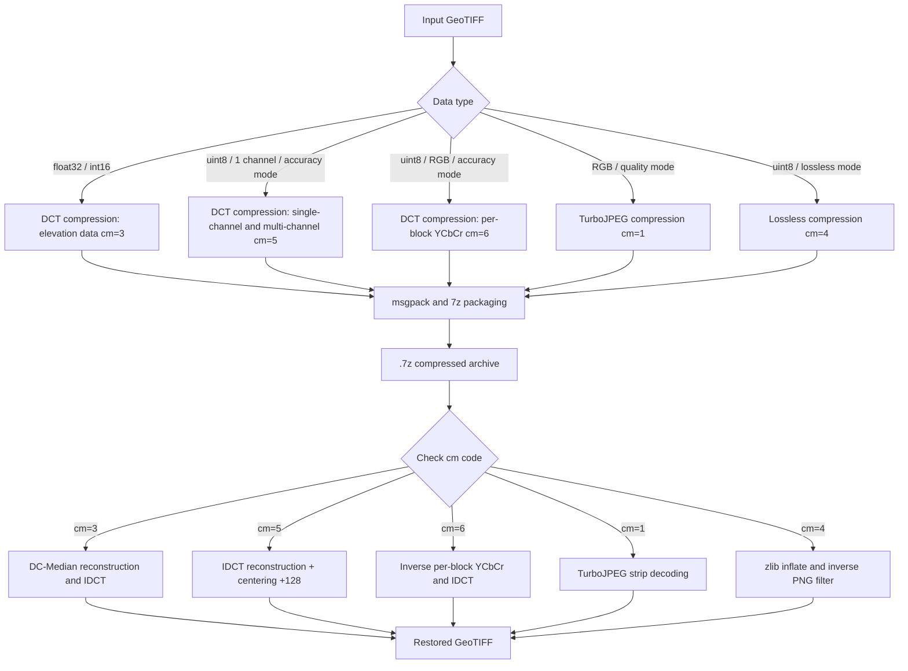

### 3.1 Compression - DCT Path (float32, `cm=3`)

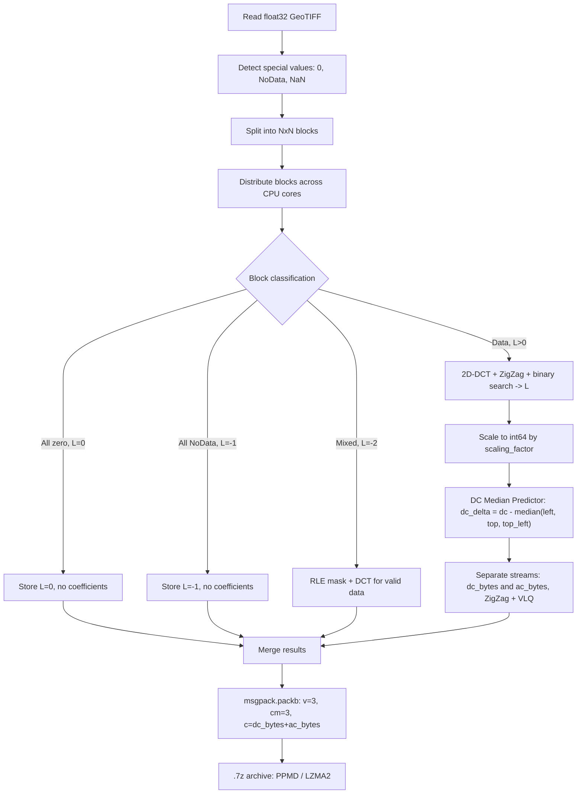

### 3.2 Compression - uint8 Accuracy Path (`cm=5`)

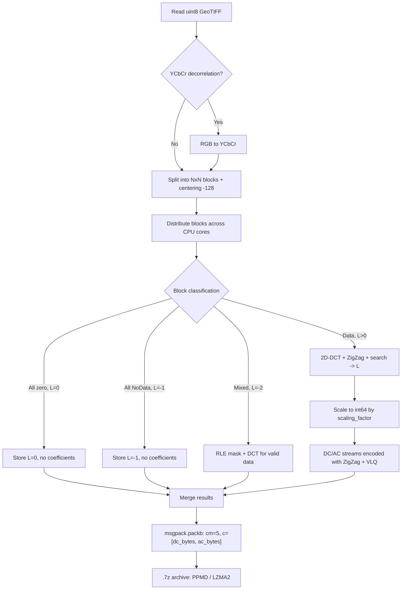

### 3.3 Compression - Per-block RGB YCbCr Path (`cm=6`)

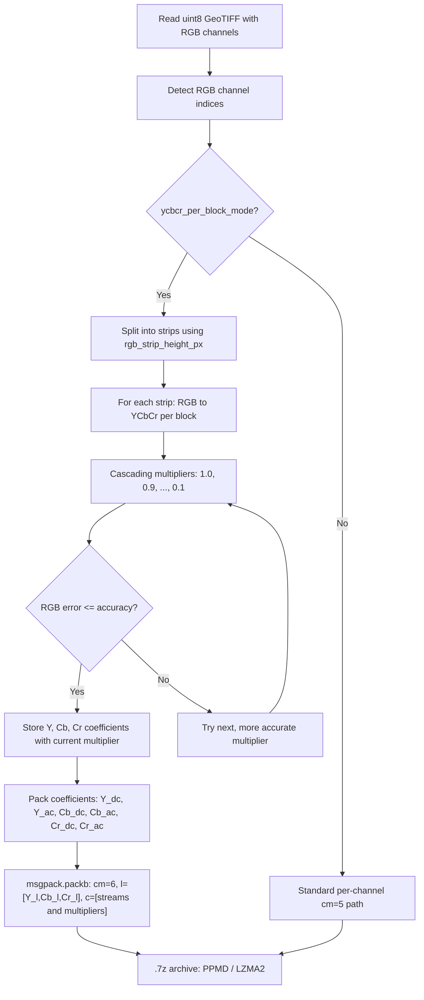

### 3.4 Compression - RGB/JPEG Quality Path

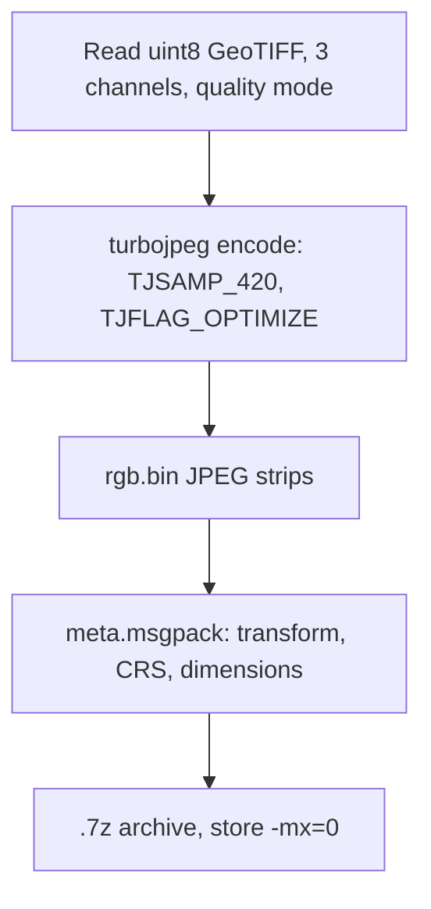

### 3.5 Compression - Lossless Path (`cm=4`)

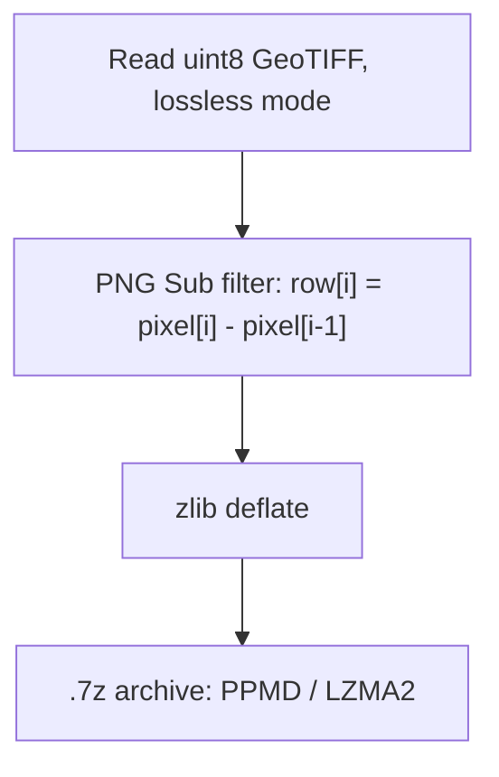

### 3.6 Decompression - DCT Path

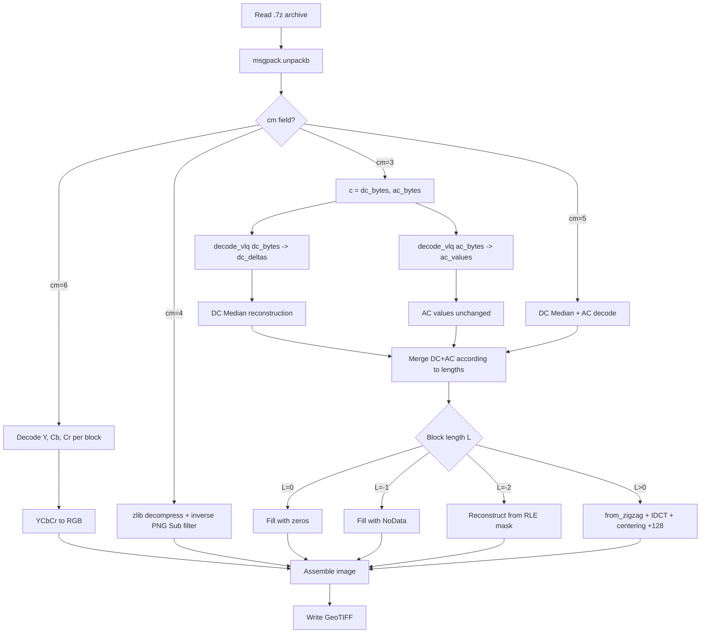

### 3.7 Decompression - RGB/JPEG Path

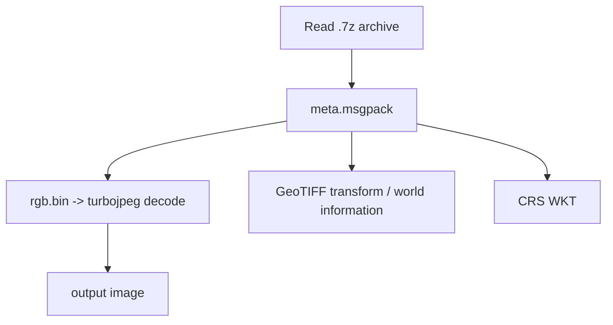

### 3.8 DC Median Predictor (`cm=3`, `cm=5`, `cm=6` streams)

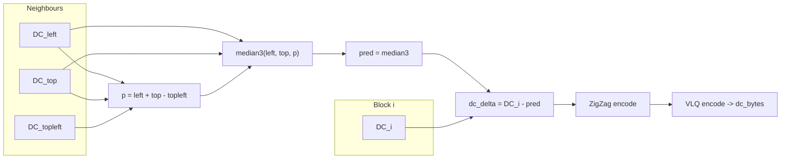

---

## 4. VLQ (Variable-Length Quantity) Encoding

The implementation uses two encoding stages.

**Stage 1 - ZigZag:** a one-to-one mapping from signed integers to non-negative integers:

$$
\mathcal{Z}(x) =
\begin{cases}
2x, & x \geq 0, \\
-2x - 1, & x < 0.
\end{cases}
$$

**Stage 2 - VLQ (Variable-Length Quantity, Base-128):** a variable-length representation with continuation bits.

**Efficiency:** ZigZag + VLQ reduces the size of DCT coefficients compared with an int32 representation (signed 32-bit integers). The actual savings depend on the value distribution in the image and should be evaluated empirically on the target data.

---

## 5. Numba JIT Acceleration

Version 2 compiles key incremental reconstruction operations with Numba JIT (`@njit`, cache in `/dev/shm` or `/tmp`):

| Function | Description |
| -------- | ----------- |
| `_nb_max_err(diff)` | maximum absolute error from the diff buffer |
| `_nb_step_add(diff, basis_k, coeff_k)` | incrementally add coefficient `k` |
| `_nb_step_sub(diff, basis_k, coeff_k)` | incrementally remove coefficient `k` |
| `_nb_jump_diff(diff, basis, coeffs, cur_L, target_L)` | jump to any `L` during binary search |

This removes Python overhead from the inner backscan and linear-search loops. JIT compilation is cached for subsequent runs.

---

## 6. Methodology for Predicting the Optimal DCT Chain Length

### 6.1 Goal of Prediction

All prediction backends have the same role: they provide a starting point `L_hat` for the search algorithm. They do not replace final error validation. The following condition is always checked:

$$
\max |B - \hat{B}| \leq \varepsilon
$$

Better prediction means fewer iterations and faster compression.

**Available backends:**

- **Binary search** - reference mode without prediction. It checks reconstruction error and searches for the smallest valid DCT chain length `L`, so it usually produces the smallest file. It is more precise in minimizing `L`, but can be slower than predictive modes.
- **Advanced Heuristic** - computes four DCT block features (`ac_abs_mean`, `zero_ratio`, `ac_std`, `std_dev`) and uses pre-trained lookup tables. This mode often reduces compression time by choosing a starting point close to the expected `L`. When `accept_prediction_if_within_accuracy` is enabled, a valid prediction can be accepted without a full binary search, which is faster but may produce a larger file. The current fast lookup grid uses 2D quantile-grid indices: 64x29/31 for float (N=8/16), and 39x10 for uint8.
- **Simple Heuristic** - predicts from block variance and simple statistical rules. It can speed up analysis for specific low-variation data, for example smooth seabed or terrain surfaces.

### 6.2 Choosing the Mode and Parameters

The best parameter fit depends on the user, the data characteristics, and the operational priority: smallest file, shortest compression time, or a compromise between both. Before compressing large collections, it is recommended to run short tests on small representative samples and compare at least `binary` and `heuristic` with the Advanced Heuristic enabled.

Example comparison settings:

| Mode | `backend` | `advanced_heuristic` | `backscan_break_after` | `accept_prediction_if_within_accuracy` |
| ---- | --------- | -------------------- | ---------------------- | -------------------------------------- |
| `binary` | `heuristic` | `False` | `0` | `False` |
| `advanced_heuristic_accept` | `heuristic` | `True` | `0` | `True` |

**`advanced_heuristic_accept`** means Advanced Heuristic plus `accept_prediction_if_within_accuracy=True`. If the lookup prediction gives an `L_hat` that satisfies the error condition, the algorithm accepts it without further binary search:

$$
\max \left|B - \hat{B}^{(\hat{L})}\right| \leq \varepsilon
$$

For float data, one predicted `L_hat` is checked. For uint8 data, the system uses the `uint8_L_prediction_scales` cascade and checks successive lengths `L_hat * s` (default: `0.9`, `1.0`, `1.1`, `1.3`, `1.5`, `2.0`). If a candidate satisfies accuracy, the smallest valid candidate from the cascade is accepted without a full binary search. If no candidate satisfies accuracy, the program switches to standard binary search using the prediction as the starting point.

### 6.3 Empirical Testing

Real prediction-backend results should be evaluated on the target data sets (DSM, DTM, orthophotos), because they depend on variance, value distribution, the share of smooth blocks, and the amount of highly variable detail. Before compressing large data collections, run short tests on small samples: compare `binary` and `heuristic`, several block sizes, the target accuracy, and settings such as `accept_prediction_if_within_accuracy`, `minimize_backscan`, and `backscan_break_after`. These tests help select a configuration that fits the data type and can then be applied to the full data series.

### 6.4 Simple Heuristic

Prediction based on block variance:

$$
\hat{L}_{heur} =
\left\lfloor
\beta(\varepsilon) \cdot N^2 \cdot \gamma(\sigma_B^2)
\right\rfloor
$$

where `beta(epsilon)` is the base share of retained coefficients for the requested accuracy, and `gamma(sigma_B^2)` is a correction derived from block variance.

### 6.5 Advanced Heuristic (Lookup Tables in `./models/`)

The `models/` directory contains pre-built lookup models trained on tens of millions of blocks to speed up DCT length prediction. These models were prepared from diverse DTM/DSM and RGB data and can be used as default prediction tables. For specialized data sets, it is recommended to build custom NPZ tables fitted to the data type, required accuracy, and value range, for example the vertical accuracy of elevation data. Such fitting can significantly improve the compression process and the trade-off between runtime and output size.

The implementation extracts **four DCT block features**: `ac_abs_mean`, `zero_ratio`, `ac_std`, and `std_dev`. The first two (`ac_abs_mean`, `zero_ratio`) are used directly as indices into the current 2D quantile lookup grid. `ac_std` and `std_dev` are still computed as diagnostic/extension features and for compatibility with earlier feature analysis. Lookup tables are precomputed offline and loaded at startup.

$$
\hat{L}_{adv} =
\mathcal{T}_{grid}\left[
\operatorname{qbin}\left(\log\left(1+\text{ac\_abs\_mean}\right)\right),
\operatorname{qbin}\left(\text{zero\_ratio}\right)
\right]
$$

**Available lookup models** (`models/` directory):

#### float32 Models (Elevation Data)

| Model | Description |
| ----- | ----------- |
| `lookup_N8_acc0.01_grid.npz` | N=8, accuracy=0.01 m |
| `lookup_N8_acc0.05_grid.npz` | N=8, accuracy=0.05 m |
| `lookup_N8_acc0.10_grid.npz` | N=8, accuracy=0.10 m |
| `lookup_N8_acc0.50_grid.npz` | N=8, accuracy=0.50 m |
| `lookup_N8_acc1.00_grid.npz` | N=8, accuracy=1.00 m |
| `lookup_N16_acc0.01_grid.npz` | N=16, accuracy=0.01 m |
| `lookup_N16_acc0.05_grid.npz` | N=16, accuracy=0.05 m |
| `lookup_N16_acc0.10_grid.npz` | N=16, accuracy=0.10 m |
| `lookup_N16_acc0.50_grid.npz` | N=16, accuracy=0.50 m |
| `lookup_N16_acc1.00_grid.npz` | N=16, accuracy=1.00 m |

NPZ keys: `grid` (uint16, 64x29 for N=8 / 64x31 for N=16), `edges_acm` (float32, 65/65), `edges_zr` (float32, 32), `acm_lookup`, `zr_lookup`.

#### uint8 YCbCr Models (RGB Images, `cm=6`)

For per-block RGB YCbCr (`cm=6`), the implementation includes separate lookup models fitted to a specific `uint8_accuracy`. The `models/` directory contains files for two scaling factors (`sf=1`, `sf=10`) and six predefined accuracies: `2`, `3`, `5`, `10`, `20`, `30` pixels. Each file contains three channel-specific prediction grids: Y, Cb, and Cr.

| Model | Description |
| ----- | ----------- |
| `lookup_uint8_ycbcr_L_N8_sf1_acc{A}_grid.npz` | N=8, sf=1, accuracy=A px |
| `lookup_uint8_ycbcr_L_N8_sf10_acc{A}_grid.npz` | N=8, sf=10, accuracy=A px |

where `{A}` is one of `{2, 3, 5, 10, 20, 30}`.

The code first tries to load the file that exactly matches the requested `uint8_accuracy`, for example `lookup_uint8_ycbcr_L_N8_sf1_acc5_grid.npz` for accuracy=5 and sf=1. If such a file is not available, it selects the nearest lower predefined accuracy from `{2, 3, 5, 10, 20, 30}`. This is a safer choice because it usually uses a more accurate model than requested. If that file is also unavailable, the program falls back to the general YCbCr grid without an accuracy suffix (`lookup_uint8_ycbcr_L_N8_sf{sf}_grid.npz`), and then to the standard uint8 grid (`lookup_uint8_L_N8_sf{sf}_grid.npz`).

NPZ keys for accuracy-specific models: `grid_L_Y`, `grid_L_Cb`, `grid_L_Cr` (float32, 39x10), `edges_acm` (float64, 40), `edges_zr` (float64, 11), `coverage_Y`, `coverage_Cb`, `coverage_Cr` (int32, 39x10).

The 39x10 grids represent 39 bins of `ac_abs_mean` by 10 bins of `zero_ratio`. In `cm=6`, the predictor uses `grid_L_Y`, `grid_L_Cb`, and `grid_L_Cr`, so the starting length `L` can be predicted separately for luminance and chrominance.

**Example model generation:** scripts for collecting features and building `.npz` files are located in `research/`. This is research and helper code, not a ready-made production pipeline. Treat it as an example of the data structure, feature extraction approach, and lookup-grid construction method that should be adapted to your own data sets, accuracy levels, and directory layout.

For the RGB/YCbCr path, the example process has two stages: first, `research/uint8_ycbcr_L_lookup.py` can collect Y, Cb, and Cr block features together with target `L` values; then `research/build_ycbcr_lookup.py` can convert feature files from `results/ycbcr_features/` into `.npz` models saved in `models/`:

```bash
python3 research/build_ycbcr_lookup.py \
    --features results/ycbcr_features \
    --models models \
    --block-sizes 8 \
    --scaling-factors 1,10 \
    --accuracies 2,3,5,10,20,30 \
    --percentile 90
```

The tables are precomputed offline and loaded at program startup.

---

## 7. Search Algorithm for the Optimal Length

### 7.1 Starting Point (`start_L`)

The search for DCT length `L` starts from a point determined by the available prediction. Prediction never replaces error validation; it only narrows or accelerates the search.

1. **Advanced Heuristic (`advanced_heuristic=True`)**

   - For float data, the predictor computes four DCT features: `ac_abs_mean`, `zero_ratio`, `ac_std`, `std_dev`.
   - The current lookup table determines `predicted_L` from (`ac_abs_mean`, `zero_ratio`).
   - `predicted_L` becomes the starting point: `start_L = predicted_L`.
   - If `accept_prediction_if_within_accuracy=true`, the program first checks whether `predicted_L` satisfies the requested accuracy. If yes, it can finish the search for this block without a full binary search. If not, it switches to binary search from this starting point.

2. **uint8 / RGB YCbCr with L prediction (`uint8_use_L_prediction=True`)**

   - For 8-bit data, `L` prediction comes from NPZ grids fitted to `sf`, `N`, and, for `cm=6`, `uint8_accuracy`.
   - If `accept_prediction_if_within_accuracy=true`, the program checks candidates from `uint8_L_prediction_scales`, by default: `0.9`, `1.0`, `1.1`, `1.3`, `1.5`, `2.0`.
   - The tested lengths are `predicted_L * scale`, clipped to the valid `L` range.
   - If at least one candidate satisfies accuracy, the smallest valid length from the cascade is selected.
   - If no candidate satisfies accuracy, the program switches to standard binary search using `predicted_L` as the starting point.

3. **Simple Heuristic (`advanced_heuristic=False`)**

   - Prediction is based on block variance.
   - The prediction result becomes `start_L = predicted_L`.
   - Further fitting uses binary search and, if configured, minimization backscan.

4. **No prediction / reference mode**

   - If prediction is unavailable, the starting point is half of all coefficients: `start_L = total_len // 2`.
   - Pure binary search then finds the smallest `L` satisfying the requested error.

### 7.2 Workflow (`refine.py`)

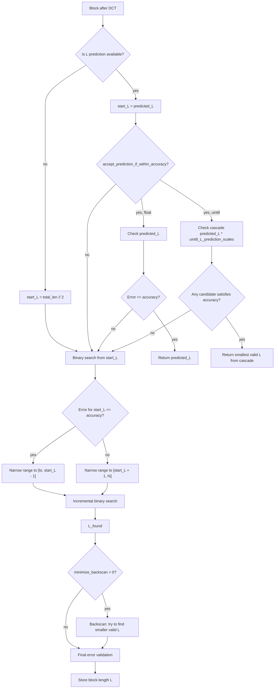

### 7.3 Features Used for Prediction

**Advanced Heuristic** (`advanced_heuristic=True`):

- The extractor computes **four DCT block features**:
  1. **`ac_abs_mean`** - mean absolute value of AC coefficients. Higher value means more high-frequency energy and usually larger `L`.
  2. **`zero_ratio`** - fraction of zeros in AC coefficients. Higher value means fewer significant coefficients and usually smaller `L`.
  3. **`ac_std`** - standard deviation of AC coefficients.
  4. **`std_dev`** - block standard deviation derived from DCT via Parseval's theorem.
- The current NPZ format (`lookup_N{8,16}_acc{*}_grid.npz`) performs prediction by lookup in a 2D quantile grid indexed by (`ac_abs_mean`, `zero_ratio`): 64x29 for N=8 and 64x31 for N=16.

**Simple Heuristic** (`advanced_heuristic=False`):

- Uses **pixel variance** of the block, without NPZ files.
- Algorithm:
  1. Compute the base length from accuracy: `base_L = accuracy_to_ratio[accuracy] * N^2`.
  2. Compute pixel variance: `var = np.var(block)`.
  3. Apply a correction from variance thresholds:
     - `var > high_threshold` -> correction = 1.3 (difficult block)
     - `var > mid_threshold` -> correction = 1.1
     - `var < low_threshold` -> correction = 0.8 (easy block)
     - otherwise -> correction = 1.0
  4. Result: `predicted_L = base_L * correction`.

### 7.4 Search Parameters

| Parameter | Default | Applies to | Description | Effect on speed/file |
| --------- | ------- | ---------- | ----------- | -------------------- |
| `minimize_backscan` | 10 | **all backends** | backscan steps after finding `L` | larger = slower, smaller file |
| `backscan_break_after` | 3 | **all backends** | stop after N consecutive failures (0 = exhaustive) | larger = faster, larger file |
| `accept_prediction_if_within_accuracy` | True | **all backends** (float and uint8) | accept a valid prediction without further search | True = faster, may produce a larger file |
| `uint8_L_prediction_scales` | `[0.9, 1.0, 1.1, 1.3, 1.5, 2.0]` | uint8 accuracy + accept | multiplier cascade for predicted `L` | wider cascade = higher chance of fast acceptance, possible larger file |

> **Note:** `minimize_backscan` and `backscan_break_after` work for **all** backends, including `binary`. More backscan means smaller files and more computation. In the current `config.json`, `backscan_break_after=3`, so the backscan may stop after three consecutive failed attempts to find a shorter valid `L`.

---

## 8. Data Encoding Modes After DCT

The most important encoding modes are:

| Mode | Data | Stored data |
| ---- | ---- | ----------- |
| `cm=3` | float32/int16, e.g. DTM/DSM | DCT with accuracy guarantee, DC/AC storage |
| `cm=5` | single uint8/int channels | DCT accuracy for 8-bit data, DC/AC storage |
| `cm=6` | RGB in accuracy mode | per-block YCbCr, separate Y/Cb/Cr storage |
| `cm=4` | uint8 lossless | lossless PNG Sub filter + zlib |
| `cm=1` / `jpeg_strips` | RGB without accuracy mode | TurboJPEG quality-based, `rgb.bin + meta.msgpack` |

### 8.1 Common DC/AC Storage

For DCT paths, coefficients are stored in two streams:

- `dc_bytes` - the first DCT coefficient of each active block, stored as a difference from neighbouring blocks,
- `ac_bytes` - the remaining coefficients of the block, stored without DC prediction.

Both streams are encoded with ZigZag + VLQ. This makes small numbers and small differences occupy fewer bytes.

DC prediction is applied only to active blocks with `L > 0`. Special blocks such as all-zero or all-NoData blocks do not store DCT coefficients and do not participate in DC prediction.

Prediction rule:

```text
plane = left_dc + top_dc - top_left_dc
predicted_dc = median(left_dc, top_dc, plane)
dc_delta = dc - predicted_dc
```

If neighbours are missing, the code uses a simple fallback:

| Available neighbours | DC prediction |
| -------------------- | ------------- |
| left + top + top_left | `median(left, top, left + top - top_left)` |
| only left | `left` |
| only top | `top` |
| no neighbours | `0` |

This mechanism is lossless with respect to the stored DCT coefficients. It does not change `L`, accuracy, or reconstruction quality. It only changes how coefficients are written into the archive.

### 8.2 Elevation Mode (`cm=3`)

`cm=3` is used for elevation and numerical data such as DTM/DSM (FLOAT). The program:

1. splits the raster into blocks,
2. applies DCT,
3. finds the smallest `L` satisfying the requested error,
4. stores block lengths in `l`,
5. stores coefficients as `c = [dc_bytes, ac_bytes]`.

Accuracy is measured in the units of the input data, for example metres or centimetres. Georeferencing, NoData, raster dimensions, and the GeoTIFF transform are stored in archive metadata.

### 8.3 Single-channel uint8 Mode (`cm=5`)

`cm=5` is used for 8-bit channels such as intensity, hillshade, or image bands processed independently. Before DCT, values are centred around zero, and the search finds `L` satisfying `uint8_accuracy`.

In the current code, `cm=5` also uses `c = [dc_bytes, ac_bytes]`. The older single VLQ stream is supported only for backward compatibility when decompressing older archives.

Compression also works for multi-channel rasters, both with and without RGB channels. Input data is read through `rasterio`, typically from GeoTIFF files. Alpha channels are skipped, and remaining bands are compressed as data channels.

If three RGB channels are configured and `ycbcr_per_block_mode` is enabled, RGB channels are compressed jointly through `cm=6`. Any remaining channels are compressed independently through the standard DCT path (`cm=5` for 8-bit accuracy data or `cm=3` for numerical data). If RGB is not defined, all channels are treated independently.

Each channel may store its own scaling factor `sf` and block size `N`. In msgpack, the channel block size `N` is technically stored in `ch_data["bs"]`, and decompression reads it before reconstructing the channel. This lets the archive restore data correctly even when channels were saved with different settings, for example after automatic parameter selection or retry with a smaller block size.

### 8.4 Per-block RGB YCbCr Mode (`cm=6`)

`cm=6` is the accuracy path for RGB images. The program first converts RGB to YCbCr because separating luminance and chrominance reduces inter-channel correlation and usually improves DCT compression:

- `Y` - luminance,
- `Cb` - blue chrominance,
- `Cr` - red chrominance.

For each block, the program compresses Y, Cb, and Cr separately, then performs full YCbCr to RGB reconstruction and checks the real maximum error in R, G, and B. A block is accepted only when the RGB error is within `uint8_accuracy`.

Accuracy selection uses the multiplier cascade from `config.json`:

```json
"ycbcr_fallback_multipliers": [1.0, 0.9, 0.8, 0.7, 0.6, 0.5, 0.4, 0.3, 0.2, 0.1]
```

For a given multiplier, the error limit for Y, Cb, and Cr is `uint8_accuracy * multiplier`. A larger multiplier is looser and usually produces a smaller file, but may fail final RGB validation. Smaller multipliers force more accurate YCbCr reconstruction and are used for more difficult blocks.

The program does not always start from the first multiplier. Based on chrominance difficulty and, when available, `L` prediction, it may start at a later cascade index. If the selected multiplier fails RGB validation, the program moves to subsequent, more accurate multipliers. The `fallback` flag marks blocks that had to move beyond the predicted start point.

The `cm=6` archive stores three sets of lengths and coefficients:

| Field | Content |
| ----- | ------- |
| `l` | `[Y_lengths, Cb_lengths, Cr_lengths]` |
| `c` | `[Y_dc, Y_ac, Cb_dc, Cb_ac, Cr_dc, Cr_ac, mult_y, mult_cb, mult_cr, fallback]` |

The `mult_y`, `mult_cb`, `mult_cr`, and `fallback` values are required for correct RGB block reconstruction. Decompression reconstructs YCbCr, converts back to RGB, and clips values to the 0-255 range.

### 8.5 Lossless uint8 Mode (`cm=4`)

`cm=4` is used for exact reconstruction of uint8 data (`max error = 0`). It does not use DCT. Instead it applies:

- a PNG Sub filter, storing differences between neighbouring pixels in a row,
- zlib deflate compression.

This mode usually produces larger files than DCT accuracy mode, but preserves data without any loss. The output filename contains the suffix `LF`.

### 8.6 Main msgpack Fields

| Field | Meaning |
| ----- | ------- |
| `cm` | coding mode: `3`, `4`, `5`, or `6` |
| `l` | block lengths `L`; for `cm=6`, separate for Y, Cb, and Cr |
| `c` | coefficient data or lossless data |
| `m` | RLE masks for NoData and zeros |
| `sf` | channel scaling factor, if stored |
| `bs` | stored block size `N` for the channel; if missing, global `n` is used |

The main implementation files are `core/codec.py`, `compress/compression.py`, and `compress/decompression.py`.

### 8.7 TurboJPEG Mode (`cm=1`, quality-based)

TurboJPEG is the fast path for RGB `uint8` images when `uint8_accuracy_mode=false`. In this mode, the program does not use FIDWAC block DCT with error validation. Instead it uses `libjpeg-turbo` and stores the image as JPEG strips (`jpeg_strips`).

This path is controlled by JPEG quality:

```json
"rgb_quality": 85
```

Higher `rgb_quality` usually means better image quality and a larger file. Lower values mean more loss and a smaller file. This mode does not guarantee a maximum error in pixels or data units and can introduce excessive uncontrolled noise. It is limited to RGB images; it does not provide a single-channel mode or a multi-channel mode for more than 3 RGB channels. For RGB compression with a guaranteed error, use `cm=6`.

The archive format differs from the standard DCT path:

| Archive file | Meaning |
| ------------ | ------- |
| `rgb.bin` | consecutive JPEG strips stored as binary data |
| `meta.msgpack` | metadata: `mode="jpeg_strips"`, strip sizes and offsets, CRS, GeoTIFF transform, NoData |

During decompression, the program reads `meta.msgpack`, decodes JPEG strips, and assembles the full RGB image. Georeferencing and CRS are restored from archive metadata.

---

## 9. Data Preparation Methods

### 9.1 Block Extraction and Padding

The image is split into square blocks of size `N x N` (for example 8x8 or 16x16). If image dimensions are not multiples of `N`, missing pixels are filled by padding. Blocks containing only zeros or only NoData values (-9999) are skipped during DCT processing and encoded with a single marker, which speeds up compression.

### 9.2 Handling NoData and Zeros

Blocks containing NoData or zero values are encoded specially for better compression:

1. **Detection:** masks are created for NoData and zero positions.
2. **Interpolation:** NoData and zero values are replaced with mean values from neighbouring pixels (nearest-neighbour style interpolation), which smooths the data and improves DCT compression.
3. **DCT compression:** performed on the interpolated block without holes.
4. **Storage:** position masks are encoded with RLE together with DCT coefficients.
5. **Decompression:** masks restore the original NoData and zero values to their exact positions.

### 9.3 Automatic Block Size Selection

Automatic selection is used when `auto_select_block_size=true`. The code distinguishes two paths: numerical/float data and integer/uint8 data.

**Float / elevation data (`cm=3`):**

The program first computes channel variability, then selects candidate block sizes `N`:

- `sigma > auto_select_std_threshold_high` (default `10.0`) -> only `N=8` is tested,
- `auto_select_std_threshold_medium < sigma <= auto_select_std_threshold_high` (default `5.0-10.0`) -> `N=8` and `N=16` are tested,
- `sigma <= auto_select_std_threshold_medium` -> `N=8`, `N=16`, and `N=32` are tested.

This list is further restricted by `allowed_block_sizes` from `config.json`. For each allowed `N`, the program samples blocks (`auto_select_sample_size`, default `1000`), performs trial compression, and estimates msgpack size. The `N` with the smallest estimated size is selected.

**Integer / uint8 data (`cm=5`):**

For uint8 data, the code selects not only block size `N`, but also the scaling factor `sf`. It first tries to use the fast table `models/lookup_uint8_grid.npz`, which predicts `(sf, N)` from sample DCT features. If the table is unavailable, the program switches to sampling.

Sampling and preliminary candidate selection are controlled by three parameters in `config.json` or the GUI:

- `auto_select_sample_size` (default `1000`) - maximum number of blocks used for trial compression. Blocks are sampled across the channel, so a larger value gives a more stable estimate at the cost of time.
- `auto_select_std_threshold_high` (default `10.0`) - high-variability threshold. If channel standard deviation is above this value, float data tests only `N=8`, because strong local variability usually requires smaller blocks.
- `auto_select_std_threshold_medium` (default `5.0`) - medium-variability threshold. If standard deviation is between the medium and high thresholds, `N=8` and `N=16` are tested; below the medium threshold, `N=32` is also allowed.

In sampling mode, the program tests combinations of `sf` from `uint8_scaling_factor` and allowed `N` values. It chooses the smallest estimated size among configurations that satisfy `uint8_accuracy`. If no sampled configuration passes validation, it chooses the configuration with the smallest estimated size.

**Retry after validity failure:**

If full-channel compression returns `validity=False` and `N > 8`, the program retries with a smaller block size: `32 -> 16 -> 8`. During retry, `auto_select_block_size` is disabled so that the smaller block size is forced. The output filename receives `_VT` (valid) or `_VF` (invalid).

---

## 10. Output File Format

FIDWAC stores the result as msgpack data optimized for compression inside a `.7z` archive. The archive contains compressed data and the metadata required to automatically restore a GeoTIFF, including raster dimensions, CRS, georeferencing transform, NoData, masks, and compression parameters.

### 10.1 Two Archive Formats

| Path | When used | Archive content |
| ---- | --------- | --------------- |
| DCT / accuracy (`cm=3`, `cm=4`, `cm=5`, `cm=6`) | elevation data, single uint8 channels, RGB accuracy, lossless | one `{name}.msgpack` file packed into `.7z` |
| TurboJPEG (`cm=1`, `jpeg_strips`) | RGB `uint8` when `uint8_accuracy_mode=false` | `rgb.bin` with JPEG strips and `meta.msgpack` |

The DCT path is used when error control or lossless reconstruction is important. The TurboJPEG path is faster and quality-based, but it does not provide a maximum-error guarantee.

To create archives, the program uses native multithreaded 7z when available (`7zz`, `7zip`, `7z`), and falls back to `py7zr` if necessary.

### 10.2 DCT Archive

A DCT archive has a simple structure:

```text
output.7z
└── {name}.msgpack
```

The `.msgpack` file contains both compression data and spatial metadata. For a single channel, fields `l`, `c`, `m`, and `cm` are stored directly in the dictionary. For multi-channel rasters, the `channels` field is used, and each channel has its own compression data such as `cm`, `l`, `c`, `m`, `sf`, and `bs`.

Main fields:

| Field | Meaning |
| ----- | ------- |
| `v` | format version |
| `cm` | channel compression mode |
| `ch` | number of data channels |
| `n` | global block size `N` |
| `channels` | list of channels in a multi-channel raster |
| `s`, `p` | original raster size and padded size |
| `t`, `r` | GeoTIFF transform and CRS |
| `d`, `dn` | NoData value and whether NoData is present |
| `ycbcr_rgb` | RGB channel indices if the YCbCr path was used |

### 10.3 TurboJPEG Archive

The TurboJPEG path stores the RGB image as JPEG strips:

```text
output.7z
├── rgb.bin
└── meta.msgpack
```

`rgb.bin` contains concatenated JPEG strips. `meta.msgpack` describes how to read them: strip sizes, `y_start` positions, JPEG quality, image dimensions, CRS, GeoTIFF transform, and NoData. During decompression, the program restores the full RGB raster and writes it as GeoTIFF.

### 10.4 Filename

The archive name encodes the most important settings, including automatic or fixed `N`, accuracy or JPEG quality, DCT type, decimal places, and CRS.

Example scheme for the DCT path:

```text
{name}_{AUTO|N}{N}_{Acc...|U8acc...}_tdct{dct}_dec{decimal}_CRS{crs}_{VT|VF|LF}.7z
```

For TurboJPEG, the name includes JPEG quality, for example `_Q85_`.

| Suffix | Meaning |
| ------ | ------- |
| `_VT` | all blocks satisfy the requested error |
| `_VF` | some blocks exceed the requested error |
| `_LF` | lossless mode `cm=4` |
| `_Q85` | TurboJPEG with quality 85 or another `rgb_quality` value |

---

## 11. System Implementation

### 11.1 Modular Architecture

```text
FIDWAC_v2/
├── app.py                  # Main GUI entry point (Tkinter)
├── compress.py             # CLI interface for compression and decompression
├── config.py               # Configuration dataclasses and config.json handling
├── compress/               # Compression and decompression package
│   ├── compression.py      # Main controller routing to DCT, JPEG, or lossless paths
│   ├── compression_dct.py  # DCT compression for float32 and uint8 accuracy
│   ├── compression_jpeg.py # TurboJPEG quality-based path for uint8 RGB
│   ├── compression_lossless.py
│   ├── compression_utils.py
│   └── decompression.py
├── core/                   # Core coding and transform algorithms
│   ├── codec.py            # VLQ, ZigZag, DC Median Predictor, Numba JIT
│   └── dct.py              # Precomputed IDCT bases and math operations
├── predictor/              # L prediction backends
│   ├── predictor.py        # HeuristicPredictor and AdvancedHeuristicPredictor
│   ├── predictor_npy.py    # Quantile-grid queries
│   └── predictor_uint8.py  # uint8 L predictor and YCbCr channel grids
├── engine/                 # Block processing engine
│   ├── blocks.py           # Raster blocking, multiprocessing, YCbCr decorrelation
│   ├── refine.py           # Hybrid L search
│   └── utils.py            # Interpolation, RLE masks, helpers
├── gui/                    # GUI components
│   ├── panels.py
│   ├── runner.py
│   ├── stats.py
│   ├── theme.py
│   └── widgets.py
├── models/                 # Precomputed lookup tables (*.npz)
└── research/               # Research scripts for feature collection and example NPZ model building
    ├── build_ycbcr_lookup.py
    └── ...                 # Additional training/analysis tools that require adaptation to your data
```

**Streaming path** (`compress_channel_dct_streaming`): used for large elevation files (DSM/DTM) where loading a full channel into RAM is impractical. Workers extract blocks internally, avoiding per-block pickling overhead. This path is selected automatically when a file exceeds the memory threshold.

### 11.2 Configuration (`config.json`)

`config.json` groups program settings into five blocks: working directories, compression parameters, performance, prediction, and output format. The fields below match the current repository. The GUI (`app.py`) can also modify and overwrite this file when needed.

#### `directories`

| Parameter | Meaning |
| --------- | ------- |
| `source` | default input-data directory |
| `results` | default output directory |
| `models` | NPZ lookup-model directory for heuristics |
| `cache` | auxiliary directory for training/cache data |

#### `compression`

| Parameter | Current | Meaning |
| --------- | ------- | ------- |
| `accuracy` | `0.05` | maximum error for float data such as DTM/DSM |
| `block_size` | `8` | base block size `N`; may be changed by auto-selection |
| `decimal_places` | `2` | number of decimal places used when quantizing DCT coefficients |
| `crs` | `""` | empty means no forced CRS; the program uses CRS from the input file |
| `auto_select_block_size` | `true` | enables automatic `N` selection and, for uint8, `sf` selection |
| `auto_select_sample_size` | `1000` | number of blocks used for trial evaluation |
| `allowed_block_sizes` | `[8, 16, 32]` | allowed `N` values for auto-selection |
| `uint8_accuracy_mode` | `true` | enables accuracy mode for 8-bit data |
| `uint8_accuracy` | `5` | maximum pixel error for uint8 accuracy paths |
| `uint8_scaling_factor` | `[1, 10]` | candidate `sf` values tested for uint8 data |
| `ycbcr_per_block_mode` | `true` | enables per-block RGB YCbCr path (`cm=6`) |
| `ycbcr_fallback_multipliers` | `1.0 -> 0.1` | accuracy-multiplier cascade for RGB YCbCr blocks |
| `rgb_quality` | `85` | TurboJPEG quality, used only when `uint8_accuracy_mode=false` |
| `lossless` | `false` | enables PNG/zlib lossless mode for uint8 (`cm=4`) |

#### `performance`

| Parameter | Meaning |
| --------- | ------- |
| `num_processes` | `"auto"` uses the CPU core count; a fixed number can also be provided |
| `fast_eval_basis` | uses a fast IDCT basis when evaluating error |
| `verify_with_full_idct` | final verification by full IDCT reconstruction |
| `l2_precheck_enabled` | quick precheck that rejects obviously too-short `L` values |
| `incremental_backscan` | accelerates reducing `L` after a valid length is found |

#### `model`

| Parameter | Current | Meaning |
| --------- | ------- | ------- |
| `backend` | `heuristic` | backend for predicting the starting `L` |
| `advanced_heuristic` | `true` | uses lookup tables from `models/` |
| `minimize_backscan` | `10` | number of backward steps for finding a smaller `L` |
| `backscan_break_after` | `3` | stop backscan after three consecutive failed attempts |
| `accept_prediction_if_within_accuracy` | `true` | allows accepting a prediction if it already satisfies accuracy |
| `uint8_use_L_prediction` | `true` | uses `L` prediction for uint8 blocks |
| `uint8_L_prediction_scales` | `[0.9, 1.0, 1.1, 1.3, 1.5, 2.0]` | cascade of lengths tested around predicted `L` |

#### `output`

| Parameter | Current | Meaning |
| --------- | ------- | ------- |
| `quiet` | `false` | shows logs and progress bars |
| `delete_temp_files` | `true` | removes temporary files after archive creation |
| `compression_method` | `LZMA2` | 7z method for DCT archives (`LZMA2`, `PPMD`, `BZIP2`, `DEFLATE`) |
| `tiff_compression` | `DEFLATE` | GeoTIFF compression used during decompression |

RGB per-block mode (`cm=6`) activates when the data is `uint8`, `uint8_accuracy_mode=true`, three `rgb_channel_indices` are provided, and `ycbcr_per_block_mode=true`. Otherwise channels are compressed independently.

### 11.3 GUI (`app.py`)

The graphical interface is based on Tkinter and uses a Material Design-inspired theme:

- **Main** - input file/directory, output directory, accuracy, block size, process count.
- **Advanced** - Source/Results directories, prediction backend, search settings (backscan), output settings (7z method, TIFF compression, CRS), and real-time compression statistics.
- **Log** - real-time compression/decompression progress (`tqdm` + dual print output).

> **Note:** The Performance tab (fast evaluation, L2 precheck, incremental backscan) is hidden in the GUI. These parameters remain active in `config.json` with default values.

**Uint8 Accuracy mode:** when Accuracy mode is selected for 8-bit RGB data using per-block YCbCr (`cm=6`), the system uses `lookup_uint8_ycbcr_L_N8_sf{sf}_acc{A}_grid.npz` tables if available for the requested accuracy. It falls back to `binary` when no file is available.

**Accept prediction:** `accept_prediction_if_within_accuracy` allows the program to skip binary search when the heuristic prediction already satisfies accuracy. It works for both float and uint8 data.

**Directory processing (recursion + structure preservation):**

- Compression: recursively scans the input directory and recreates subdirectory structure in `output_dir`.
- Decompression: recursively scans `.7z` files and recreates subdirectory structure in `output_dir`.

Run:

```bash
python3 app.py
```

---

## 12. Summary of FIDWAC v2 Innovations

FIDWAC v2 introduces the following improvements over FIDWaC v1:

| No. | Area | FIDWaC v1 | FIDWAC v2 |
| --- | ---- | --------- | -------- |
| 1 | **DCT-II + ZigZag scanning** | Cosine transform and zigzag scanning. | Keeps the DCT-II + ZigZag approach, following JPEG-like coefficient ordering. |
| 2 | **`L` search** | Classic binary search starting from `agt = len // 2`. | Hybrid search: linear window + binary search + minimization backscan. |
| 3 | **RLE masks for NoData/zeros** | Special-value coding and nearest-neighbour interpolation. | Keeps this logic and integrates it with the new format and DCT paths. |
| 4 | **Multiprocessing** | Parallel block processing with `multiprocessing.Pool`. | Parallel block processing with batching and lower orchestration overhead. |
| 5 | **Serialization** | JSON / text-based data storage. | `msgpack`, a binary serialization format better suited for archive compression. |
| 6 | **RGB paths** | No dedicated RGB compression. | Two paths: per-block YCbCr (`cm=6`, accuracy-based, error <= epsilon) and TurboJPEG SIMD (`cm=1`, quality-based, no error guarantee). |
| 7 | **Coefficient encoding** | ZigZag coefficients stored as `int32` after `scaling_factor`. | ZigZag + VLQ (Variable-Length Quantity), variable-length encoding after ZigZag mapping. |
| 8 | **DC Median Predictor + DC/AC** | No separate DC prediction or DC/AC streams. | Spatial DC prediction (`median3` from left, top, top_left), delta storage, and separate DC/AC streams for `cm=3`, `cm=5`, and `cm=6` channels. |
| 9 | **Numba JIT** | Pure Python/NumPy in critical sections. | Numba JIT acceleration for incremental reconstruction and backscan. |
| 10 | **Hybrid binary search** | Returned the first `L` satisfying accuracy. | Performs backscan after finding a valid `L` to find a smaller valid length. |
| 11 | **`L` prediction** | No prediction; start from `agt = len // 2`. | Simple / Advanced Heuristic with automatic fallback; the AI path was removed. |
| 12 | **Archive compression** | `py7zr`, Python-based, usually single-threaded. | Native 7z/7zz with PPMD/LZMA2; priority: `7zz > 7zip > 7z > py7zr`. |
| 13 | **GUI** | No GUI, mostly CLI usage. | Tkinter GUI with log preview, configuration tabs, and directory handling. |
| 14 | **Adaptive backscan** | No backscan. | `minimize_backscan` and `backscan_break_after`; by default the search may stop after 3 consecutive failed attempts. |
| 15 | **Adaptive `N` selection** | Fixed block size from configuration. | Automatic `N` selection based on image statistics and sampling. |
| 16 | **IDCT basis** | Full IDCT evaluated repeatedly. | Precomputed basis vectors accelerate reconstruction checks. |
| 17 | **DCT feature analysis** | No feature-grid predictor. | Predictor computes 4 features (`ac_abs_mean`, `zero_ratio`, `ac_std`, `std_dev`), while fast lookup uses (`ac_abs_mean`, `zero_ratio`). |
| 18 | **Lookup grids** | No precomputed prediction tables. | Precomputed lookup grids with interpolation/fallback for empty cells. |
| 19 | **Fast L2 verification** | More complete candidate evaluation. | L2 precheck rejects unsuitable lengths before full error evaluation. |
| 20 | **Format versioning** | Limited format compatibility control. | Version number in the header and backward-compatibility mechanisms. |
| 21 | **Recursive directories** | No full input directory hierarchy restoration. | GUI and CLI scan directories recursively and restore hierarchy in the output directory. |
| 22 | **YCbCr decorrelation** | No RGB -> YCbCr transform. | RGB -> YCbCr before DCT for uint8 accuracy, reducing file size at the same RGB error guarantee. |
| 23 | **uint8 accuracy mode (`cm=5`)** | No dedicated accuracy path for single 8-bit channels. | Maximum error guarantee for values 0-255, centering -128, and adaptive `scaling_factor`. |
| 24 | **Lossless PNG mode (`cm=4`)** | No dedicated lossless uint8 mode. | PNG Sub filter + zlib, `max error = 0`. |
| 25 | **Per-block RGB YCbCr (`cm=6`)** | No RGB path with error guarantee. | Default RGB accuracy path with cascading multipliers, RGB validation, and compact stream packing. |
| 26 | **Pixel-based `strip_height`** | No memory control for RGB strips. | `rgb_strip_height_px` controls memory use in pixels, with an internal limit protecting batch processing. |

---

## 13. Performance Test Results - FIDWAC v2 vs SZ3

Tests were performed on real geospatial data: multi-channel orthophotos (UINT8), RGB imagery, and numerical terrain/surface models (DTM/DSM, float32). The reference compressor was **SZ3** (SZx family, Lorenzo predictor), a leading open-source lossy compressor for scientific data.

> **Test environment:** AMD Ryzen 9 5950X, 128 GB RAM, SSD, WSL2/Ubuntu 22.04

---

### 13.1 Results Table

#### UINT8 Multiband (6 channels, 10,000 files, 30.4 GB total)

| Accuracy (max error) | Original | SZ3 [GB] | FIDWAC v2 [GB] | CR SZ3 | CR FIDWAC v2 | FIDWAC advantage |
| -------------------- | -------- | -------- | -------------- | ------ | ------------ | ---------------- |
| 2 px | 30.4 GB | 15.50 | **10.80** | 1.96 | **2.81** | **+43%** |
| 5 px | 30.4 GB | 10.40 | **8.58** | 2.92 | **3.54** | **+21%** |
| 10 px | 30.4 GB | 7.06 | **6.67** | 4.31 | **4.56** | **+6%** |
| 20 px | 30.4 GB | 4.65 | 4.57 | 6.54 | 6.65 | +2% (tie) |

#### RGB (3-channel orthophoto)

| Data | Original | SZ3 [GB] | FIDWAC v2 [GB] | CR SZ3 | CR FIDWAC v2 | Result |
| ---- | -------- | -------- | -------------- | ------ | ------------ | ------ |
| RGB | 299.5 GB | 133.0 | **99.2** | 2.25 | **3.02** | **FIDWAC +34%** |

#### FLOAT32 (Numerical Terrain/Surface Models)

| Data | Original | SZ3 [MB] | FIDWAC v2 [MB] | CR SZ3 | CR FIDWAC v2 | Result |
| ---- | -------- | -------- | -------------- | ------ | ------------ | ------ |
| DSM (complex terrain, buildings) | 2320 MB | 582.5 | 913.1 | **3.98** | 2.54 | **SZ3 +57%** |
| DTM (smooth terrain) | 515.8 MB | 23.5 | 53.5 | **21.95** | 9.64 | **SZ3 +128%** |
| Float32 Multiband (acc=0.05) | 31.6 GB | 6.78 | **6.64** | 4.66 | **4.76** | Tie (+2%) |

---

### 13.2 Charts

#### CR Comparison for All Data Types

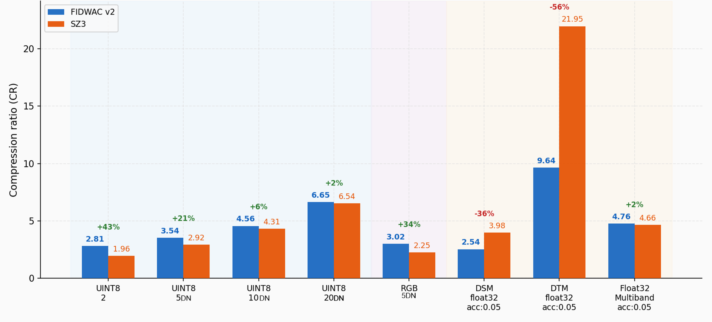

#### UINT8 - CR as a Function of Accuracy

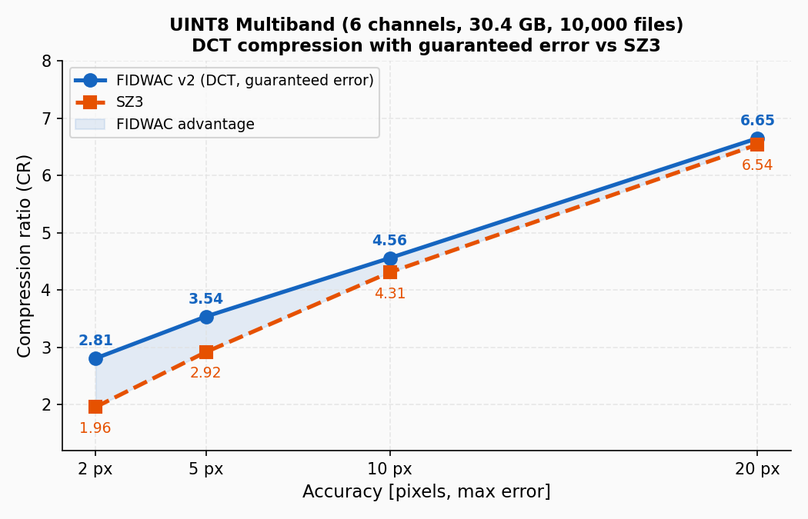

#### UINT8 - Compressed File Size [GB]

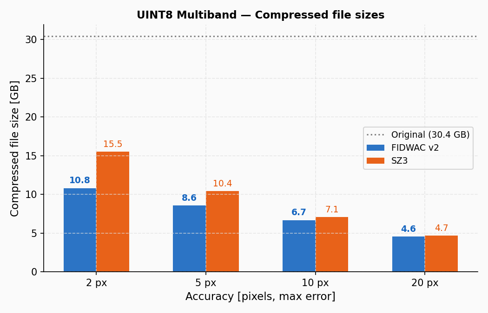

---

### 13.3 Result Analysis

#### UINT8 / RGB (Imagery: Orthophotos, Satellite Images)

FIDWAC v2 performs very well on image data. The smaller the tolerated error (higher accuracy requirement), the stronger the advantage:

- **epsilon = 2 px:** FIDWAC reaches CR=2.81 versus SZ3 CR=1.96, giving **43% smaller files** with the same error guarantee.
- **epsilon = 5 px:** +21%, a significant advantage.
- **epsilon = 10-20 px:** the advantage decreases to about 6-2%, effectively a practical tie.

This follows from the architecture: **per-block YCbCr with cascading multipliers (`cm=6`)** packs RGB data more efficiently than a channel-wise Lorenzo predictor. DCT naturally decorrelates signal energy in the frequency domain, especially for textured multi-channel orthophotos.

#### FLOAT32 (DEM: DSM, DTM)

SZ3 dominates on smooth elevation data. The mathematical reason is that the Lorenzo predictor (`pred = left + top - topleft`) works extremely well on near-flat surfaces, where DTM residuals can be close to zero at sub-metre accuracy. FIDWAC DCT must still store DC and several AC coefficients even for flat blocks.

- **DTM:** SZ3 CR=21.95 vs FIDWAC CR=9.64. The gap is explained by smooth relief (terrain sigma often below 1 m per block).
- **DSM (buildings, forest):** higher variation reduces the gap: SZ3 CR=3.98 vs FIDWAC CR=2.54.
- **Float32 Multiband** (acc=0.05): practical tie, FIDWAC 4.76 vs SZ3 4.66.

#### Application Context: Morphological Data (CMORPH)

FIDWAC (Łysko et al., 2025) was used in the **CMORPH** software (Śledziowski et al., 2025), which processes high-resolution UAV/LiDAR DEM data for automatic shoreline detection and dune/cliff morphology analysis. The input data are GeoTIFF files (float32/uint8) with sub-metre resolution.

FIDWAC v2 was used to compress data sets in a project carried out under the **INFOSTRATEG V** Strategic Programme for Scientific Research and Development Works of the National Centre for Research and Development, topic: **"Automatic detection of topographic objects (ADETOPO)"**. The project was implemented by a scientific-industrial consortium consisting of the Maritime University of Szczecin and GISPRO.

---

### 13.4 Conclusions

| Data type | Recommendation | Reason |
| --------- | -------------- | ------ |
| UINT8 orthophoto (epsilon <= 10 px) | **FIDWAC v2** | +6-43% better CR, guaranteed per-pixel error |
| RGB imagery | **FIDWAC v2** | +34% CR, per-block YCbCr |
| Float32 DTM (smooth terrain) | **SZ3** | Lorenzo predictor dominates on continuous fields |
| Float32 DSM (complex terrain) | **SZ3** | better CR, although the advantage is smaller than for DTM |
| Float32 Multiband (acc=0.05) | Tie | about 2% difference |
| **Scientific data requiring max-error guarantee** | **FIDWAC v2** | stores georeferencing and provides explicit per-pixel/point error control |

> **Chart generation script:** `analysis/generate_compression_charts.py`

---

## License and Citation

FIDWAC v2 is distributed under the MIT License. See `LICENSE` for the full text.

For academic use, repository citation metadata is available in `CITATION.cff`, and Zenodo-oriented deposit metadata is available in `.zenodo.json`.

---

## Bibliography

1. Śledziowski, J., Maćków, W., Łysko, A., Giza, A., Tanwari, K., & Terefenko, P. (2025). CMORPH – An open-source application for coastal morphology detection and analysis. *SoftwareX*, 31, 102295. ISSN 2352-7110. [https://doi.org/10.1016/j.softx.2025.102295](https://doi.org/10.1016/j.softx.2025.102295).
2. Łysko, A., Maćków, W., Forczmański, P., Terefenko, P., Giza, A., Śledziowski, J., Stępień, G., & Tomczak, A. (2023). CCMORPH — Coastal Cliffs Morphology Analysis Toolbox. *SoftwareX*, 22, 101386. ISSN 2352-7110. [https://doi.org/10.1016/j.softx.2023.101386](https://doi.org/10.1016/j.softx.2023.101386).
3. Łysko, A., Maleika, W., Maćków, W., Bondarewicz, M., Śledziowski, J., & Terefenko, P. (2025). FIDWaC - Fast inverse distance weighting and compression. *SoftwareX*, 31, 102300. ISSN 2352-7110. [https://doi.org/10.1016/j.softx.2025.102300](https://doi.org/10.1016/j.softx.2025.102300).
4. Ahmed, N., Natarajan, T., & Rao, K. R. (1974). Discrete Cosine Transform. *IEEE Transactions on Computers*, C-23(1), 90-93.
5. Pennebaker, W. B., & Mitchell, J. L. (1992). *JPEG Still Image Data Compression Standard*. Springer.
6. Sayood, K. (2017). *Introduction to Data Compression* (5th ed.). Morgan Kaufmann.
7. ZSIP/FIDWaC - Original implementation: https://github.com/ZSIP/FIDWaC
8. ZSIP/FIDWAC_v2 - https://github.com/ZSIP/FIDWAC_v2

---

*FIDWAC v2 was developed as an extension of the FIDWaC project, adding advanced entropy coding, statistical prediction, and JIT acceleration for lossy compression of geospatial data.*
