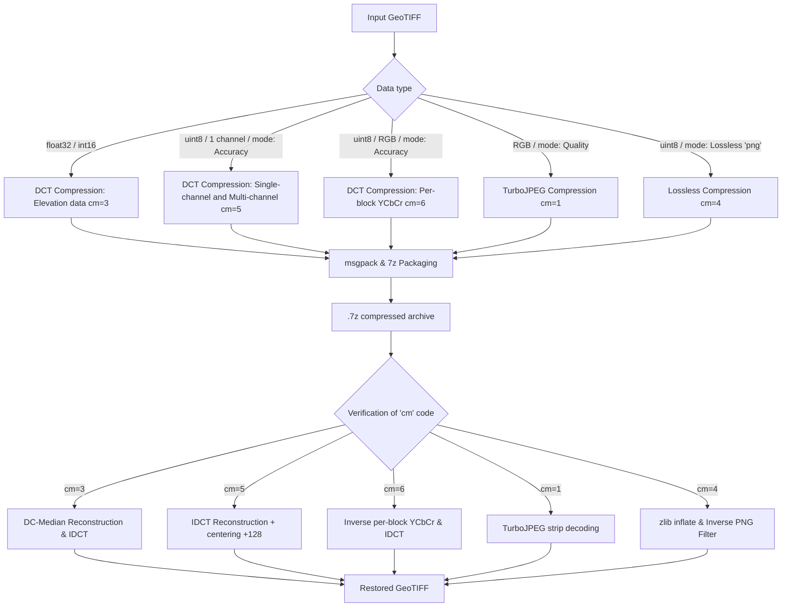
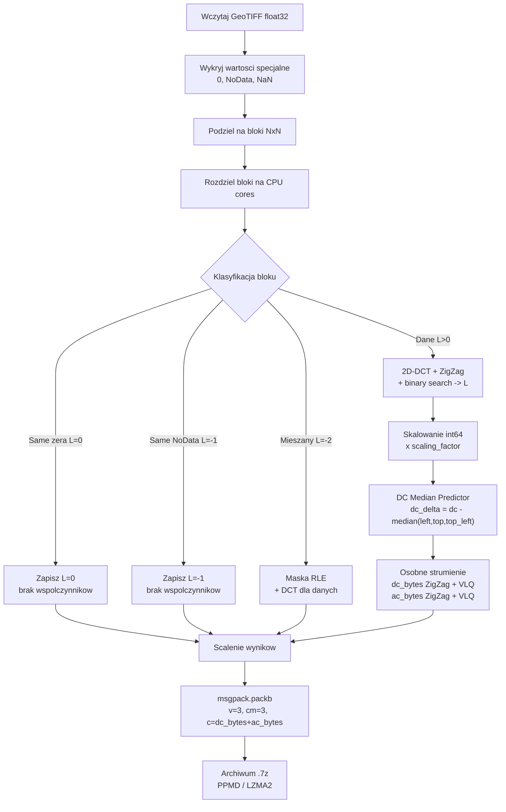
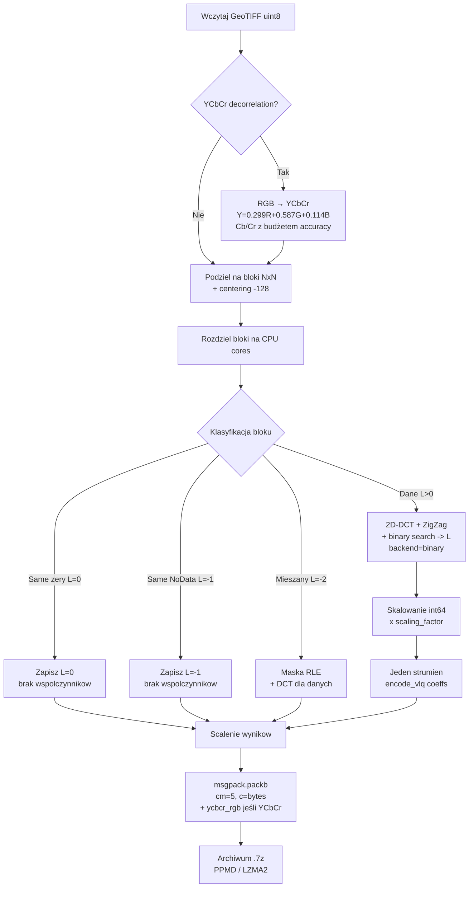
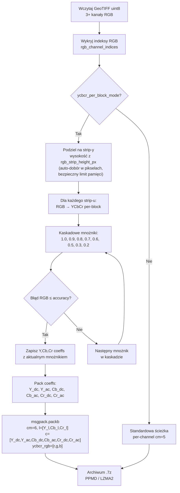
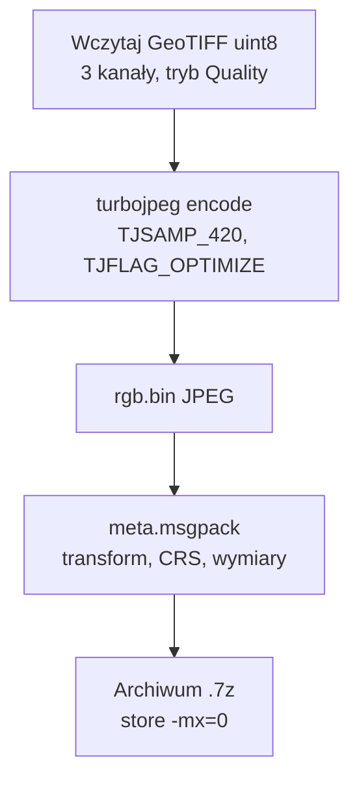
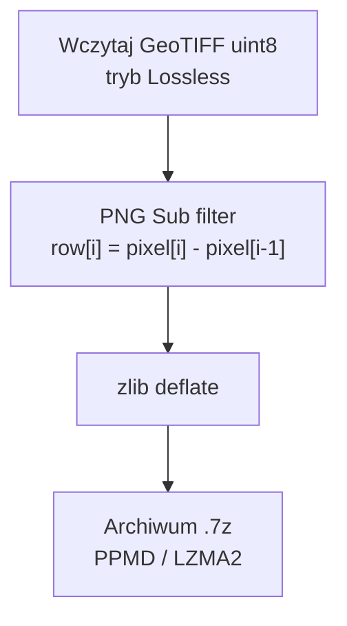
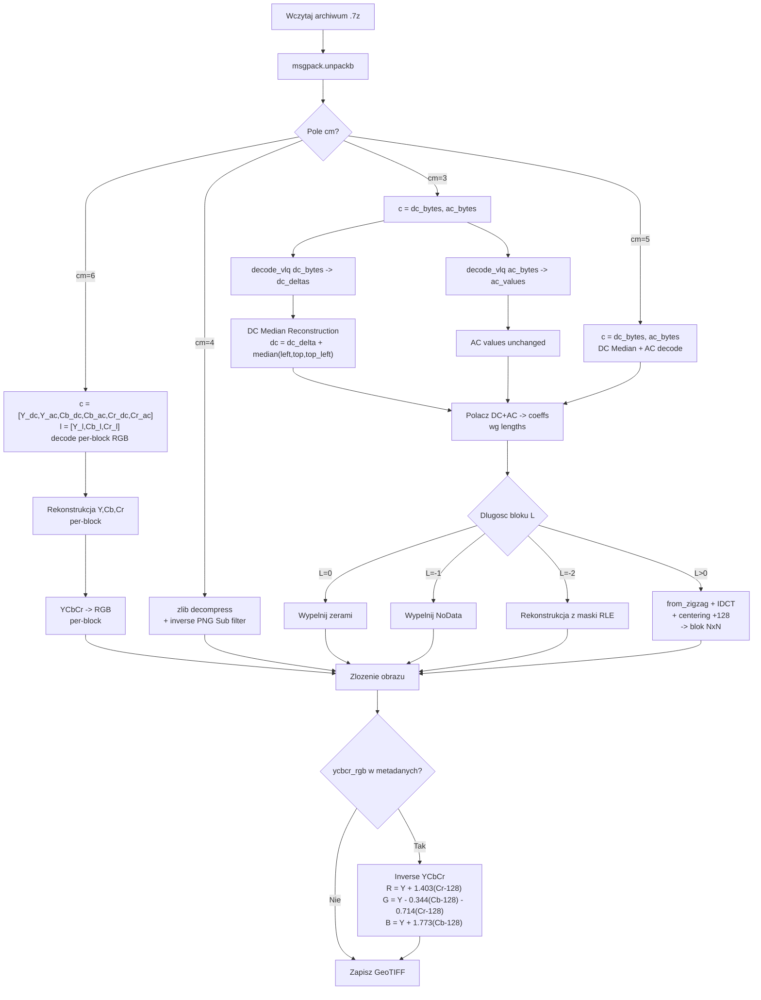
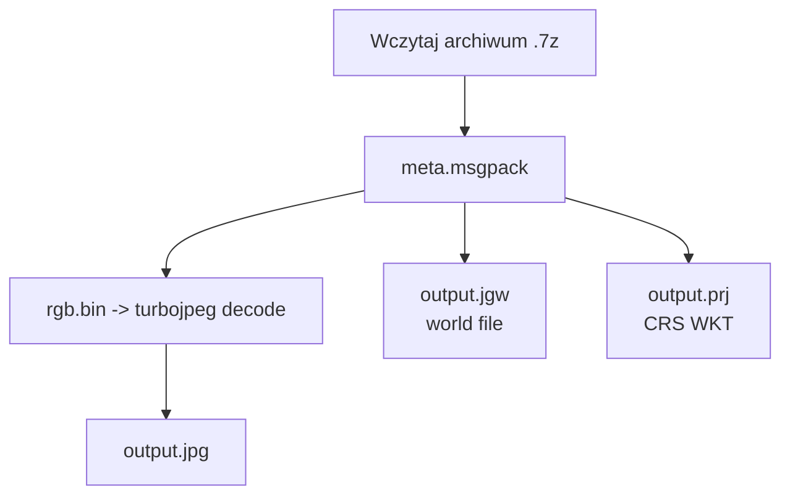
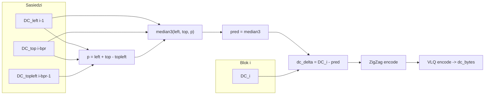
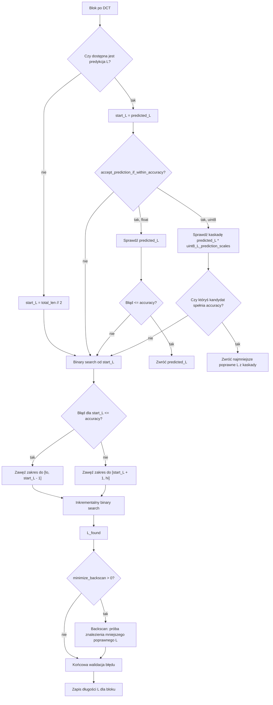

# FIDWAC v2 - Zaawansowana kompresja stratna DCT dla danych geoprzestrzennych

## Spis treści

- [Streszczenie](#streszczenie)
- [1. Wprowadzenie i kontekst teoretyczny](#1-wprowadzenie-i-kontekst-teoretyczny)
  - [1.1 Podstawy matematyczne transformacji DCT](#11-podstawy-matematyczne-transformacji-dct)
  - [1.2 Problem optymalizacji kompresji](#12-problem-optymalizacji-kompresji)
- [2. Główne różnice względem FIDWaC v1](#2-główne-różnice-względem-fidwac-v1)
- [3. Schematy przepływu danych](#3-schematy-przepływu-danych)
- [4. Implementacja](#4-implementacja)
- [5. Struktura katalogów i moduły](#5-struktura-katalogów-i-moduły)
- [6. API FIDWAC v2](#6-api-fidwac-v2)
- [7. Predyktor statystyczny i LUT](#7-predyktor-statystyczny-i-lut)
- [8. Kodowanie entropijne](#8-kodowanie-entropijne)
- [9. Testy wydajności i benchmarki](#9-testy-wydajności-i-benchmarki)
- [Wymagania systemowe i instalacja](#wymagania-systemowe-i-instalacja)
  - [Wymagania systemowe](#wymagania-systemowe)
  - [Instalacja na Windows (WSL2)](#instalacja-na-windows-wsl2)
  - [Instalacja na Linux (natywnie)](#instalacja-na-linux-natywnie)
  - [Instalacja — Rozwiązywanie problemów](#instalacja--rozwiązywanie-problemów)
- [Uruchamianie](#uruchamianie)
  - [GUI (Graficzny interfejs użytkownika)](#gui-graficzny-interfejs-użytkownika)
  - [Linia poleceń (CLI)](#linia-poleceń-cli)
  - [Parametry kompresji](#parametry-kompresji)
- [Bibliografia](#bibliografia)

---

## Streszczenie

FIDWAC v2 (Fast Inverse Distance Weighting and Compression, wersja 2) stanowi następną, rozwojową wersję, oryginalnego systemu FIDWaC (https://github.com/ZSIP/FIDWaC.git).  System podobnie jak w pierwotnej wersji, implementuje podejście do kompresji stratnej danych rastrowych z gwarancją maksymalnego błędu aproksymacji, wykorzystując dwuwymiarową dyskretną transformację kosinusową (2D-DCT) z adaptacyjnym doborem liczby współczynników.

Wersja V2, wprowadza akcelerację Numba JIT dla kluczowych operacji matematycznych z szybszą indeksacją bloków danych, hybrydowy algorytm wyszukiwania z inkrementalną rekonstrukcją błędu, graficzny interfejs użytkownika (GUI) oraz pięć dedykowanych ścieżek przetwarzania danych typu UINT8/INT8/FLOAT:

1. **Kompresja DCT dla danych wysokościowych (float32/int16)** — przeznaczona dla obrazów jednokanałowych danych ciągłych (np. modele wysokościowe DEM/DTM, siatki interpolacji IDW), która gwarantuje maksymalny błąd ≤ε w jednostkach pierwotnych (metry, centymetry). Wykorzystuje predyktor DC Median3 z osobnymi strumieniami DC/AC (tryb `cm=3`).
2. **Standardowa kompresja DCT (uint8 accuracy)** — przeznaczona dla obrazów jednokanałowych (np. kanały intensywności LiDAR, cieniowanie rzeźby terenu Hillshade), która gwarantuje maksymalny błąd ≤ε w skali szarości (0–255), bez transformacji przestrzeni barw (tryb `cm=5`).
3. **Per-block YCbCr z kaskadowymi mnożnikami** — przeznaczona dla wielokanałowych obrazów RGB z włączonym trybem accuracy, gwarantująca maksymalny błąd ≤ε w przestrzeni RGB przy użyciu precyzyjnego dopasowania współczynników dla poszczególnych bloków (tryb `cm=6`).
4. **TurboJPEG (SIMD)** — alternatywna, szybka ścieżka dla RGB bez trybu accuracy (oparta na jakości - quality-based), która wykorzystuje standardową kompresję JPEG (libjpeg-turbo) bez formalnej gwarancji maksymalnego błędu aproksymacji. Jest to bardzo szybka metoda pakowania plików, jednak dająca nadmiarowy niekontrolowany szum. Metoda ta nie ma trybu jednokanałowego ani trybu wielokanałowego > 3 RGB (tryb `cm=1` z meta.msgpack).
5. **Kompresja bezstratna (lossless)** — przeznaczona dla danych uint8 wymagających dokładnej rekonstrukcji (max error = 0), wykorzystująca filtr PNG Sub + kompresję zlib deflate. Metoda ta nie ma trybu jednokanałowego ani trybu wielokanałowego > 3 RGB. (tryb `cm=4`).

**FIDWAC:** W odróżnieniu od typowych kompresorów tablicowych, takich jak ZFP czy SZ3, FIDWAC przechowuje razem ze skompresowanymi danymi parametry georeferencji i metadane rastra. Archiwum zawiera m.in. transformację DCT dla danych dekompresowanych do GeoTIFF, parametry georeferencji CRS, wymiary obrazu, zakodowane informacje o NoData oraz maski wartości specjalnych, dzięki czemu dekompresja automatycznie odtwarza gotowy do użycia plik GeoTIFF, bez ręcznego dopisywania georeferencji lub rekonstruowania parametrów przestrzennych.

---

## 1. Wprowadzenie i kontekst teoretyczny

### 1.1 Podstawy matematyczne transformacji DCT

System FIDWAC v2 implementuje dwuwymiarową dyskretną transformację kosinusową typu II (DCT-II), definiowaną dla macierzy blokowej `A` o wymiarach `N x N` jako:

$$
X_{u,v} =
\frac{2}{N}\alpha(u)\alpha(v)
\sum_{i=0}^{N-1}\sum_{j=0}^{N-1}
A_{i,j}
\cos\left(\frac{\pi(2i+1)u}{2N}\right)
\cos\left(\frac{\pi(2j+1)v}{2N}\right)
$$

gdzie `alpha(k) = 1/sqrt(2)` dla `k = 0` oraz `alpha(k) = 1` w przeciwnym przypadku.

Przy tej normalizacji transformacja jest ortonormalna, a transformacja odwrotna (IDCT) ma postać:

$$
A_{i,j} =
\frac{2}{N}
\sum_{u=0}^{N-1}\sum_{v=0}^{N-1}
\alpha(u)\alpha(v)X_{u,v}
\cos\left(\frac{\pi(2i+1)u}{2N}\right)
\cos\left(\frac{\pi(2j+1)v}{2N}\right)
$$

### 1.2 Problem optymalizacji kompresji

Dla każdego bloku `B_k` o wymiarach `N x N` definiujemy problem minimalizacji:

$$
\min_{L_k} \quad L_k
\quad \text{przy ograniczeniu} \quad
\max_{(i,j)} \left|B_k[i,j] - \hat{B}_k^{(L_k)}[i,j]\right| \leq \varepsilon
$$

gdzie:

- `L_k` — liczba zachowanych współczynników DCT (zigzag) dla bloku `k`
- `B_hat_k(L_k)` — rekonstrukcja przy użyciu `L_k` współczynników
- `epsilon` — zadana dokładność (accuracy)

---

## 2. Główne różnice względem FIDWaC v1

| Aspekt                                                   | FIDWaC v1      | FIDWAC v2                                                                                                                              |
| -------------------------------------------------------- | -------------- | -------------------------------------------------------------------------------------------------------------------------------------- |
| **Serializacja**                                   | JSON (tekst)   | msgpack (binarny) + VLQ (Variable-Length Quantity, kodowanie zmiennej długości)                                                        |
| **Repr. współczynników**                        | ZigZag + int32 (32-bitowa liczba całkowita ze znakiem) | ZigZag + VLQ (Variable-Length Quantity, kodowanie zmiennej długości)                                   |
| **Kompresja archiwum**                             | py7zr (Python) | 7zz/7zip/7z (natywny, wielowątkowy)                                                                                                   |
| **Metoda kompresji 7z**                            | domyślna      | PPMD / LZMA2 / BZIP2 / DEFLATE                                                                                                         |
| **Automatytczne Wyszukiwanie długości DCT -  L** | binary search  | hybrydowy: okno liniowe + binary search                                                                                                |
| **Akceleracja JIT**                                | brak           | Numba JIT (kluczowe operacje)                                                                                                          |
| **GUI**                                            | brak           | Tkinter GUI (rekurencja, zachowanie struktury katalogów)                                                                              |
| **Predykcja**                                      | brak           | Simple / Advanced Heuristic (lookup table)                                                                                             |
| **Kompresja RGB**                                  | brak           | 1) Per-block YCbCr kaskadowe (cm=6, accuracy-based, gwarantuje błąd ≤ε) 2) TurboJPEG strips (quality-based, bez gwarancji błędu) |
| **uint8 accuracy (cm=5)**                          | brak           | binary search DCT z gwarancją błędu ≤ε pikseli (min ε=2), z centering -128, adaptacyjny sf                                       |
| **Lossless PNG (cm=4)**                            | brak           | PNG Sub filter + zlib deflate, max error = 0                                                                                           |
| **YCbCr decorrelation**                            | brak           | RGB→YCbCr przed DCT, redukcja korelacji międzykanałowej                                                                             |
| **Per-block YCbCr (cm=6)**                         | brak           | Hybrydowy per-block kaskadowy dobór mnożników YCbCr, błąd sprawdzany w RGB, szybsza kompresja niż globalne dopasowanie           |

---

## 3. Schematy przepływu danych

### 3.0 Modułowa architektura i ścieżki (Routing) danych wejściowych

System FIDWAC v2 charakteryzuje się modułową architekturą, która automatycznie rozpoznaje format, typ danych oraz liczbę kanałów wejściowego rastra, kierując go na optymalną ścieżkę kompresji i dekompresji (wybór kodowania `cm`):



### 3.1 Kompresja - ścieżka DCT (float32, cm=3)



### 3.2 Kompresja - ścieżka uint8 accuracy (cm=5)



### 3.3 Kompresja - ścieżka per-block RGB YCbCr (cm=6)



### 3.4 Kompresja - ścieżka RGB/JPEG Quality



### 3.4 Kompresja - ścieżka Lossless (cm=4)



### 3.5 Dekompresja - ścieżka DCT



### 3.7 Dekompresja - ścieżka RGB/JPEG



### 3.7 Szczegółowy schemat DC Median Predictor (cm=3)



---

## 4. Kodowanie VLQ (Variable-Length Quantity)

Implementacja wykorzystuje dwuetapowe kodowanie.

**Etap 1 — ZigZag:** jednoznaczne odwzorowanie liczb całkowitych ze znakiem na nieujemne liczby całkowite:

$$
\mathcal{Z}(x) =
\begin{cases}
2x, & x \geq 0, \\
-2x - 1, & x < 0.
\end{cases}
$$

**Etap 2 — VLQ (Variable-Length Quantity, Base-128):** reprezentacja zmiennej długości ze znacznikiem kontynuacji.

**Efektywność:** Kodowanie ZigZag + VLQ redukuje rozmiar współczynników DCT w porównaniu do reprezentacji int32 (32-bitowych liczb całkowitych ze znakiem). Rzeczywiste oszczędności zależą od rozkładu wartości w danym obrazie i wymagają empirycznego testowania na konkretnych danych.

---

## 5. Akceleracja Numba JIT

Wersja 2 kompiluje kluczowe operacje inkrementalnej rekonstrukcji za pomocą Numba JIT (`@njit`, cache na `/dev/shm` lub `/tmp`):

| Funkcja                                                 | Opis                                                            |
| ------------------------------------------------------- | --------------------------------------------------------------- |
| `_nb_max_err(diff)`                                   | maksymalny błąd bezwzględny z bufora diff                    |
| `_nb_step_add(diff, basis_k, coeff_k)`                | inkrementalne dodanie współczynnika k (krok w dół L→L-1)   |
| `_nb_step_sub(diff, basis_k, coeff_k)`                | inkrementalne odjęcie współczynnika k (krok w górę L→L+1) |
| `_nb_jump_diff(diff, basis, coeffs, cur_L, target_L)` | skok do dowolnego L w binary search                             |

Eliminuje narzut Python dla wewnętrznej pętli backscan i wyszukiwania liniowego. Kompilacja JIT jest buforowana dla kolejnych uruchomień.

---

## 6. Metodologia predykcji optymalnej długości łańcucha DCT

### 6.1 Cel predykcji

Wszystkie backendy predykcyjne pełnią tę samą rolę: dostarczają punkt startowy `L_hat` dla algorytmu wyszukiwania. Nie zastępują końcowej walidacji błędu — poniższy warunek jest zawsze sprawdzany:

$$
\max |B - \hat{B}| \leq \varepsilon
$$

Lepsza predykcja oznacza mniej iteracji i szybszą kompresję.

**Dostępne backendy:**

- **Binary search** — tryb referencyjny bez predykcji. Sprawdza błąd rekonstrukcji i wyszukuje możliwie najmniejszą długość łańcucha DCT `L`, dlatego zwykle daje najmniejszy plik. Jest dokładniejszy pod względem minimalizacji `L`, ale może być wolniejszy od trybów predykcyjnych.
- **Advanced Heuristic** — predyktor oblicza 4 cechy bloku DCT (`ac_abs_mean`, `zero_ratio`, `ac_std`, `std_dev`) i korzysta z wcześniej wyuczonych tabel lookup przygotowanych na dużym zbiorze bloków treningowych. Tryb często skraca czas kompresji, ponieważ wybiera punkt startowy blisko oczekiwanej długości `L`. Gdy włączone jest `accept_prediction_if_within_accuracy`, może zaakceptować poprawną predykcję bez pełnego binary searcha, co dodatkowo przyspiesza kompresję, ale może dać większy plik. Aktualny szybki lookup grid używa indeksów siatki kwantylowej 2D: 64×29/31 dla float (N=8/16), 39×10 dla uint8.
- **Simple Heuristic** — predykcja oparta na wariancji bloku i prostych regułach statystycznych. Może przyspieszać analizę dla specyficznych, mało zróżnicowanych danych, np. gładkich fragmentów dna morskiego lub terenów o niewielkiej zmienności.

### 6.2 Dobór trybu i parametrów

Dokładne dopasowanie parametrów zależy od użytkownika, charakterystyki danych oraz priorytetu pracy: minimalny rozmiar pliku, krótszy czas kompresji albo kompromis między tymi celami. Zaleca się wykonanie wstępnych prób na małych, reprezentatywnych fragmentach danych i porównanie co najmniej dwóch wariantów: trybu `binary` oraz trybu `heuristic` z włączoną heurystyką zaawansowaną.

Przykładowe konfiguracje porównawcze:

| Tryb                          | `backend`   | `advanced_heuristic` | `backscan_break_after` | `accept_prediction_if_within_accuracy` |
| ----------------------------- | ------------- | ---------------------- | ------------------------ | ---------------------------------------- |
| `binary`                    | `heuristic` | `False`              | `0`                    | `False`                                |
| `advanced_heuristic_accept` | `heuristic` | `True`               | `0`                    | `True`                                 |

**Tryb `advanced_heuristic_accept`** = Advanced Heuristic + `accept_prediction_if_within_accuracy=True`. Jeśli predykcja z tabeli lookup daje długość `L_hat` spełniającą warunek błędu, algorytm akceptuje ją bez dalszego binary searcha:
$$
\max \left|B - \hat{B}^{(\hat{L})}\right| \leq \varepsilon
$$

Dla danych float sprawdzane jest jedno przewidywane `L_hat`. Dla danych uint8 system używa kaskady `uint8_L_prediction_scales`, czyli sprawdza kolejne długości `L_hat * s` (domyślnie: `0.9`, `1.0`, `1.1`, `1.3`, `1.5`, `2.0`). Jeśli któryś kandydat spełnia accuracy, algorytm akceptuje najmniejszą poprawną długość z tej kaskady bez pełnego binary searcha. Jeśli żaden kandydat nie spełnia accuracy, program przechodzi do standardowego wyszukiwania binary search z punktem startowym wynikającym z predykcji.

### 6.3 Empiryczne testowanie

Rzeczywiste wyniki porównania backendów predykcji należy oceniać na konkretnych zbiorach danych (DSM, DTM, ortofoto), ponieważ zależą one od wariancji, rozkładu wartości, udziału bloków gładkich oraz liczby fragmentów silnie zróżnicowanych. Przed kompresją dużych zasobów warto przeprowadzić krótkie testy na małych próbkach: sprawdzić `binary` i `heuristic`, kilka rozmiarów bloku, docelową dokładność oraz ustawienia `accept_prediction_if_within_accuracy`, `minimize_backscan` i `backscan_break_after`. Wyniki takich prób pozwalają dobrać konfigurację najlepiej pasującą do danego typu danych, a następnie zastosować ją dla całej serii plików.

### 6.4 Heurystyka prosta

Predykcja oparta na wariancji bloku:

$$
\hat{L}_{heur} =
\left\lfloor
\beta(\varepsilon) \cdot N^2 \cdot \gamma(\sigma_B^2)
\right\rfloor
$$

gdzie `beta(epsilon)` oznacza bazowy udział zachowywanych współczynników zależny od wymaganej dokładności, a `gamma(sigma_B^2)` oznacza korekcję wynikającą z wariancji bloku.

### 6.5 Heurystyka zaawansowana (tabela lookup w ./models/)

W katalogu `models/` udostępniono wstępnie przygotowane modele lookup, wyuczone na kilkudziesięciu milionach bloków, aby przyspieszyć predykcję długości łańcucha DCT. Modele te zostały przygotowane na zróżnicowanych danych DTM/DSM oraz RGB i mogą być używane jako domyślne tabele predykcyjne. W przypadku specyficznych zbiorów danych zaleca się jednak przygotowanie własnych tabel NPZ, dopasowanych do charakteru danych, oczekiwanej dokładności oraz zakresu wartości (np. dokładności pionowej dla modeli wysokościowych). Takie dopasowanie może znacząco usprawnić proces kompresji i poprawić relację między czasem działania a rozmiarem pliku wynikowego.

Wdrożenie ekstraktuje **4 cechy bloku DCT**: `ac_abs_mean`, `zero_ratio`, `ac_std` oraz `std_dev`. Dwie pierwsze cechy (`ac_abs_mean`, `zero_ratio`) są używane bezpośrednio jako indeksy aktualnej siatki kwantylowej 2D lookup. `ac_std` i `std_dev` pozostają liczone w predyktorze jako cechy diagnostyczne/rozszerzeniowe oraz dla zgodności z wcześniejszą analizą cech. Tabele lookup są prekomputowane offline i ładowane przy starcie systemu.
$$
\hat{L}_{adv} =
\mathcal{T}_{grid}\left[
\operatorname{qbin}\left(\log\left(1+\text{ac\_abs\_mean}\right)\right),
\operatorname{qbin}\left(\text{zero\_ratio}\right)
\right]
$$

**Dostępne modele lookup** (katalog `models/`):

#### Modele float32 (dane wysokościowe)

| Model                           | Opis                  |
| ------------------------------- | --------------------- |
| `lookup_N8_acc0.01_grid.npz`  | N=8, accuracy=0.01 m  |
| `lookup_N8_acc0.05_grid.npz`  | N=8, accuracy=0.05 m  |
| `lookup_N8_acc0.10_grid.npz`  | N=8, accuracy=0.10 m  |
| `lookup_N8_acc0.50_grid.npz`  | N=8, accuracy=0.50 m  |
| `lookup_N8_acc1.00_grid.npz`  | N=8, accuracy=1.00 m  |
| `lookup_N16_acc0.01_grid.npz` | N=16, accuracy=0.01 m |
| `lookup_N16_acc0.05_grid.npz` | N=16, accuracy=0.05 m |
| `lookup_N16_acc0.10_grid.npz` | N=16, accuracy=0.10 m |
| `lookup_N16_acc0.50_grid.npz` | N=16, accuracy=0.50 m |
| `lookup_N16_acc1.00_grid.npz` | N=16, accuracy=1.00 m |

Klucze NPZ: `grid` (uint16, 64×29 dla N=8 / 64×31 dla N=16), `edges_acm` (float32, 65/65), `edges_zr` (float32, 32), `acm_lookup`, `zr_lookup`.

#### Modele uint8 YCbCr (obrazy RGB, cm=6)

Dla trybu per-block RGB YCbCr (`cm=6`) wdrożono osobne modele lookup dopasowane do konkretnej dokładności `uint8_accuracy`. W katalogu `models/` znajdują się pliki dla dwóch wartości scaling factor (`sf=1`, `sf=10`) oraz sześciu predefiniowanych dokładności: `2`, `3`, `5`, `10`, `20`, `30` pikseli. Każdy plik zawiera trzy kanałowe siatki predykcji długości `L`: osobno dla Y, Cb i Cr.

| Model                                            | Opis                      |
| ------------------------------------------------ | ------------------------- |
| `lookup_uint8_ycbcr_L_N8_sf1_acc{A}_grid.npz`  | N=8, sf=1, accuracy=A px  |
| `lookup_uint8_ycbcr_L_N8_sf10_acc{A}_grid.npz` | N=8, sf=10, accuracy=A px |

gdzie dokładność accuracy to `{A}` ∈ `{2, 3, 5, 10, 20, 30}`.

Kod najpierw próbuje załadować plik dokładnie odpowiadający żądanej wartości `uint8_accuracy`, np. `lookup_uint8_ycbcr_L_N8_sf1_acc5_grid.npz` dla accuracy=5 i sf=1. Jeśli taki plik nie istnieje, wybierana jest najbliższa mniejsza predefiniowana dokładność z listy `{2, 3, 5, 10, 20, 30}`. Oznacza to wybór bezpieczniejszego, zwykle dokładniejszego modelu niż żądana wartość. Jeśli również taki plik nie jest dostępny, program przechodzi do ogólnej siatki YCbCr bez oznaczenia accuracy (`lookup_uint8_ycbcr_L_N8_sf{sf}_grid.npz`), a następnie do standardowej siatki uint8 (`lookup_uint8_L_N8_sf{sf}_grid.npz`).

Klucze NPZ dla modeli dopasowanych do accuracy: `grid_L_Y`, `grid_L_Cb`, `grid_L_Cr` (float32, 39×10), `edges_acm` (float64, 40), `edges_zr` (float64, 11), `coverage_Y`, `coverage_Cb`, `coverage_Cr` (int32, 39×10).

Siatki 39×10 oznaczają 39 binów `ac_abs_mean` × 10 binów `zero_ratio`. W trybie `cm=6` predyktor używa siatek kanałowych `grid_L_Y`, `grid_L_Cb`, `grid_L_Cr`, dzięki czemu długość startowa `L` może być przewidywana osobno dla luminancji i chrominancji.

**Przykładowe generowanie modeli:** skrypty do zbierania cech i budowania plików `.npz` znajdują się w katalogu `research/`. Jest to kod badawczy i pomocniczy, a nie gotowy docelowy pipeline produkcyjny. Należy traktować go jako przykład struktury danych, sposobu ekstrakcji cech i budowy siatek lookup, który trzeba dostosować do własnych zbiorów danych, własnych poziomów dokładności oraz własnej organizacji katalogów.

Dla ścieżki RGB/YCbCr przykładowy proces składa się z dwóch etapów: najpierw `research/uint8_ycbcr_L_lookup.py` może zebrać cechy bloków Y, Cb i Cr wraz z docelowymi wartościami `L`, a następnie `research/build_ycbcr_lookup.py` może przekształcić takie pliki cech z `results/ycbcr_features/` do modeli `.npz` zapisywanych w `models/`:

```bash
python3 research/build_ycbcr_lookup.py \
    --features results/ycbcr_features \
    --models models \
    --block-sizes 8 \
    --scaling-factors 1,10 \
    --accuracies 2,3,5,10,20,30 \
    --percentile 90
```

Tabele są prekomputowane offline i ładowane przy starcie systemu.

---

## 7. Algorytm wyszukiwania optymalnej długości

### 7.1 Punkt startowy (`start_L`)

Algorytm wyszukiwania długości `L` rozpoczyna pracę od punktu startowego zależnego od dostępnej predykcji. Predykcja nie zastępuje walidacji błędu. Służy tylko do zawężenia lub przyspieszenia wyszukiwania.

1. **Advanced Heuristic (`advanced_heuristic=True`)**

   - Dla danych float predyktor oblicza 4 cechy DCT: `ac_abs_mean`, `zero_ratio`, `ac_std`, `std_dev`.
   - Aktualna tabela lookup wyznacza `predicted_L` na podstawie pary (`ac_abs_mean`, `zero_ratio`).
   - `predicted_L` staje się punktem startowym: `start_L = predicted_L`.
   - Jeśli `accept_prediction_if_within_accuracy=true`, program najpierw sprawdza, czy `predicted_L` spełnia wymaganą dokładność. Jeśli tak, może zakończyć wyszukiwanie dla tego bloku bez pełnego binary searcha. Jeśli nie, przechodzi do binary search od tego punktu startowego.

2. **Uint8 / RGB YCbCr z predykcją L (`uint8_use_L_prediction=True`)**

   - Dla danych 8-bitowych predykcja `L` pochodzi z siatek NPZ dopasowanych do `sf`, `N` i, dla `cm=6`, do `uint8_accuracy`.
   - Jeśli `accept_prediction_if_within_accuracy=true`, program sprawdza kandydatów z `uint8_L_prediction_scales`, domyślnie: `0.9`, `1.0`, `1.1`, `1.3`, `1.5`, `2.0`.
   - Testowane są długości `predicted_L * scale`, po ograniczeniu do poprawnego zakresu wartości `L`.
   - Jeśli co najmniej jeden kandydat spełnia accuracy, wybierana jest najmniejsza poprawna długość z tej kaskady.
   - Jeśli żaden kandydat nie spełnia accuracy, program przechodzi do standardowego binary search z punktem startowym `predicted_L`.

3. **Simple Heuristic (`advanced_heuristic=False`)**

   - Predykcja opiera się na wariancji bloku.
   - Wynik predykcji staje się punktem startowym: `start_L = predicted_L`.
   - Dalsze dopasowanie wykonuje binary search oraz, jeśli skonfigurowano, backscan minimalizacji.

4. **Brak predykcji / tryb referencyjny**

   - Jeśli predykcja nie jest dostępna, punkt startowy ustawiany jest na połowę wszystkich współczynników: `start_L = total_len // 2`.
   - Następnie wykonywany jest pure binary search, który szuka najmniejszego `L` spełniającego zadany błąd.

### 7.2 Schemat działania (`refine.py`)



### 7.3 Cechy używane do predykcji

**Advanced Heuristic** (`advanced_heuristic=True`):

- Ekstraktor oblicza **cztery cechy bloku DCT**:
  1. **ac_abs_mean** — średnia wartość bezwzględna współczynników AC
     - Wysoka wartość = więcej energii w wysokich częstotliwościach = większe L
     - Niska wartość = mało energii = mniejsze L
  2. **zero_ratio** — ułamek zer w współczynnikach AC
     - Wysoki zero_ratio = mało znaczących współczynników = mniejsze L
     - Niski zero_ratio = wiele znaczących współczynników = większe L
  3. **ac_std** — odchylenie standardowe współczynników AC
  4. **std_dev** — odchylenie standardowe bloku wyznaczane z DCT przez twierdzenie Parsevala
- Aktualny format NPZ (`lookup_N{8,16}_acc{*}_grid.npz`) wykonuje predykcję przez wyszukanie w siatce kwantylowej 2D indeksowanej parą (`ac_abs_mean`, `zero_ratio`) — 64×29 dla N=8, 64×31 dla N=16

**Simple Heuristic** (`advanced_heuristic=False`):

- Opiera się na **wariancji pikseli** bloku (bez plików NPZ)
- Algorytm:
  1. Oblicz bazową długość L na podstawie accuracy: `base_L = accuracy_to_ratio[accuracy] × N²`
  2. Oblicz wariancję pikseli: `var = np.var(block)`
  3. Zastosuj korekcję na podstawie progów wariancji:
     - `var > high_threshold` → correction = 1.3 (trudny blok)
     - `var > mid_threshold` → correction = 1.1
     - `var < low_threshold` → correction = 0.8 (łatwy blok)
     - inaczej → correction = 1.0
  4. Wynik: `predicted_L = base_L × correction`

### 7.4 Parametry wyszukiwania

| Parametr                                 | Domyślnie          | Dotyczy backendów                  | Opis                                      | Wpływ na szybkość/plik                            |
| ---------------------------------------- | ------------------- | ----------------------------------- | ----------------------------------------- | ---------------------------------------------------- |
| `minimize_backscan`                    | 10                  | **wszystkie**                 | kroki backscanu po znalezieniu L          | Większe = wolniejsze, mniejszy plik                 |
| `backscan_break_after`                 | 3                   | **wszystkie**                 | przerwij po N failach z rzędu (0 = wyczerpujący) | Większe = szybsze, większy plik                    |
| `accept_prediction_if_within_accuracy` | True                | **wszystkie** (float & uint8) | akceptuj predykcję bez dalszego szukania | True = szybsze, ale może dać większy plik           |
| `uint8_L_prediction_scales`            | `[0.9, 1.0, 1.1, 1.3, 1.5, 2.0]` | uint8 accuracy + accept             | kaskada mnożników dla przewidywanego L  | Szersza kaskada = większa szansa szybkiej akceptacji, ale możliwy większy plik |

> **Uwaga:** `minimize_backscan` i `backscan_break_after` działają dla **wszystkich** backendów, w tym `binary`. Wyższy backscan = mniejszy plik, więcej obliczeń. W obecnym `config.json` `backscan_break_after=3`, więc backscan może zakończyć się po trzech kolejnych nieudanych próbach znalezienia krótszego poprawnego `L`.

---

## 8. Tryby kodowania danych po DCT

Najważniejsze są tryby kodowania:

| Tryb | Dane | Co zapisuje |
| ---- | ---- | ----------- |
| `cm=3` | float32/int16, np. DTM/DSM | DCT z gwarancją accuracy, zapis DC/AC |
| `cm=5` | pojedyncze kanały uint8/int | DCT accuracy dla danych 8-bitowych, zapis DC/AC |
| `cm=6` | RGB w trybie accuracy | per-block YCbCr, osobny zapis Y/Cb/Cr |
| `cm=4` | uint8 lossless | bezstratny PNG Sub filter + zlib |
| `cm=1` / `jpeg_strips` | RGB bez trybu accuracy | TurboJPEG quality-based, `rgb.bin + meta.msgpack` |

### 8.1 Wspólny zapis DC/AC

Dla ścieżek DCT program zapisuje współczynniki w dwóch strumieniach:

- `dc_bytes` — pierwszy współczynnik DCT każdego aktywnego bloku, zapisany jako różnica względem sąsiadów,
- `ac_bytes` — pozostałe współczynniki bloku, czyli AC, zapisane bez predykcji DC.

Oba strumienie są kodowane przez ZigZag + VLQ. Dzięki temu małe liczby i małe różnice zajmują mniej bajtów.

Predykcja DC działa tylko na aktywnych blokach, czyli takich, które mają `L > 0`. Bloki specjalne, np. same zera lub same NoData, nie mają współczynników DCT i nie biorą udziału w predykcji DC.

Reguła predykcji jest prosta:

```text
plane = left_dc + top_dc - top_left_dc
predicted_dc = median(left_dc, top_dc, plane)
dc_delta = dc - predicted_dc
```

Jeśli brakuje sąsiadów, kod używa prostego fallbacku:

| Dostępni sąsiedzi | Predykcja DC |
| ----------------- | ------------ |
| left + top + top_left | `median(left, top, left + top - top_left)` |
| tylko left | `left` |
| tylko top | `top` |
| brak sąsiadów | `0` |

Ten mechanizm jest bezstratny względem zapisanych współczynników DCT. Nie zmienia wartości `L`, nie zmienia accuracy i nie pogarsza rekonstrukcji. Zmienia tylko sposób zapisu współczynników w archiwum.

### 8.2 Tryb wysokościowy (`cm=3`)

Tryb `cm=3` jest używany dla danych wysokościowych i numerycznych, np. DTM/DSM (FLOAT). Program:

1. dzieli raster na bloki,
2. wykonuje DCT,
3. szuka najmniejszego `L`, które spełnia zadany błąd,
4. zapisuje długości bloków w `l`,
5. zapisuje współczynniki jako `c = [dc_bytes, ac_bytes]`.

Dokładność jest liczona w jednostkach danych wejściowych, np. metrach lub centymetrach. Georeferencja, NoData, wymiary i transformacja GeoTIFF są zapisywane w metadanych archiwum.

### 8.3 Tryb pojedynczego kanału uint8 (`cm=5`)

Tryb `cm=5` jest używany dla pojedynczych kanałów 8-bitowych, np. intensywności, hillshade lub kanałów obrazu przetwarzanych osobno. Program przed DCT centruje wartości wokół zera, a potem szuka `L` spełniającego `uint8_accuracy`.

W aktualnym kodzie `cm=5` również korzysta z formatu `c = [dc_bytes, ac_bytes]`. Starszy pojedynczy strumień VLQ jest obsługiwany tylko jako kompatybilność wsteczna przy dekompresji starszych archiwów.

Kompresja działa także dla rastrów wielokanałowych, zarówno takich, które zawierają kanały RGB, jak i takich, które ich nie zawierają. Dane wejściowe są czytane przez `rasterio`, najczęściej z plików GeoTIFF. Kanały alfa są pomijane, a pozostałe pasma są kompresowane jako kanały danych.

Jeśli w konfiguracji wskazano trzy kanały RGB i włączono `ycbcr_per_block_mode`, kanały RGB są kompresowane wspólnie ścieżką `cm=6`. Pozostałe kanały, jeśli istnieją, są kompresowane niezależnie standardową ścieżką DCT (`cm=5` dla danych 8-bitowych accuracy albo `cm=3` dla danych numerycznych). Jeśli RGB nie jest zdefiniowane, wszystkie kanały są traktowane niezależnie.

Dla każdego kanału może zostać zapisany własny scaling factor `sf` oraz rozmiar bloku `N`. W formacie msgpack wartość `N` kanału jest przechowywana technicznie w polu `ch_data["bs"]`, a dekompresja odczytuje ją przed rekonstrukcją kanału. Dzięki temu archiwum poprawnie odtwarza dane także wtedy, gdy kanały zostały zapisane z różnymi ustawieniami, np. po automatycznym doborze parametrów albo po retry z mniejszym rozmiarem bloku.

### 8.4 Tryb RGB YCbCr per-block (`cm=6`)

Tryb `cm=6` jest ścieżką accuracy dla obrazów RGB. Program najpierw przelicza kanały RGB na YCbCr, ponieważ rozdzielenie luminancji i chrominancji zmniejsza korelację między kanałami i zwykle poprawia skuteczność kompresji DCT:

- `Y` — luminancja,
- `Cb` — chrominancja niebieska,
- `Cr` — chrominancja czerwona.

Dla każdego bloku program kompresuje osobno komponenty Y, Cb i Cr, a następnie wykonuje pełną rekonstrukcję YCbCr → RGB i sprawdza rzeczywisty maksymalny błąd w kanałach R, G i B. Blok jest zaakceptowany dopiero wtedy, gdy błąd RGB mieści się w `uint8_accuracy`.

Dobór dokładności odbywa się przez kaskadę mnożników z `config.json`:

```json
"ycbcr_fallback_multipliers": [1.0, 0.9, 0.8, 0.7, 0.6, 0.5, 0.4, 0.3, 0.2, 0.1]
```

Dla danego mnożnika limit błędu komponentów Y, Cb i Cr jest ustawiany jako `uint8_accuracy * multiplier`. Większy mnożnik oznacza luźniejszy limit błędu dla komponentów YCbCr i zwykle mniejszy plik, ale może nie przejść końcowej walidacji RGB z poziomem accuracy. Dlatego też podczas walidacji bloku mniejszy mnożnik wymusza dokładniejszą rekonstrukcję YCbCr i jest używany dla trudniejszych bloków.

Program nie zawsze zaczyna od pierwszego mnożnika. Na podstawie trudności chrominancji oraz, jeśli dostępna jest predykcja `L`, może rozpocząć od dalszego indeksu kaskady. Jeśli wybrany mnożnik nie spełni warunku błędu RGB, program przechodzi do kolejnych, dokładniejszych mnożników. Flaga `fallback` oznacza, że blok wymagał przejścia dalej niż przewidywany punkt startowy.

W archiwum `cm=6` zapisuje trzy zestawy długości i współczynników:

| Pole | Zawartość |
| ---- | --------- |
| `l` | `[Y_lengths, Cb_lengths, Cr_lengths]` |
| `c` | `[Y_dc, Y_ac, Cb_dc, Cb_ac, Cr_dc, Cr_ac, mult_y, mult_cb, mult_cr, fallback]` |

Mnożniki `mult_y`, `mult_cb`, `mult_cr` oraz flaga `fallback` są potrzebne do poprawnej rekonstrukcji bloków RGB. Dekompresja odtwarza YCbCr, wykonuje transformację odwrotną do RGB i przycina wartości do zakresu 0–255.

### 8.5 Tryb bezstratny uint8 (`cm=4`)

Tryb `cm=4` służy do dokładnej rekonstrukcji danych uint8, czyli `max error = 0`. Nie używa DCT. Zamiast tego stosuje:

- filtr PNG Sub, czyli różnice między sąsiednimi pikselami w wierszu,
- kompresję zlib deflate.

Ten tryb daje zwykle większe pliki niż DCT accuracy, ale zachowuje dane bez żadnej straty. W nazwie pliku pojawia się suffix `LF`.

### 8.6 Najważniejsze pola msgpack

| Pole | Znaczenie |
| ---- | --------- |
| `cm` | tryb kodowania: `3`, `4`, `5` albo `6` |
| `l` | długości `L` dla bloków; dla `cm=6` osobno dla Y, Cb i Cr |
| `c` | dane współczynników lub dane lossless |
| `m` | maski RLE dla NoData i zer |
| `sf` | scaling factor kanału, jeśli został zapisany |
| `bs` | zapisany rozmiar bloku `N` dla kanału; jeśli brak, używany jest globalny `n` |

Implementacyjnie odpowiadają za to głównie `core/codec.py`, `compress/compression.py` i `compress/decompression.py`.

### 8.7 Tryb TurboJPEG (`cm=1`, quality-based)

Tryb TurboJPEG jest szybką ścieżką dla obrazów RGB `uint8`, gdy `uint8_accuracy_mode=false`. W tym trybie program nie wykonuje DCT blokowego FIDWAC z walidacją błędu. Zamiast tego używa biblioteki `libjpeg-turbo` i zapisuje obraz jako paski JPEG (`jpeg_strips`).

Ta ścieżka jest oparta na parametrze jakości JPEG:

```json
"rgb_quality": 85
```

Im wyższa wartość `rgb_quality`, tym zwykle lepsza jakość obrazu i większy plik. Im niższa wartość, tym większa stratność i mniejszy plik. Ten tryb nie gwarantuje maksymalnego błędu w pikselach ani w jednostkach danych. Do kompresji z gwarancją błędu dla RGB należy używać `cm=6`.

Format archiwum różni się od standardowej ścieżki DCT:

| Plik w archiwum | Znaczenie |
| --------------- | --------- |
| `rgb.bin` | kolejne paski JPEG zapisane binarnie |
| `meta.msgpack` | metadane: `mode="jpeg_strips"`, rozmiary i offsety pasków, CRS, transformacja GeoTIFF, NoData |

Podczas dekompresji program odczytuje `meta.msgpack`, dekoduje paski JPEG i składa pełny obraz RGB. Georeferencja oraz CRS są odtwarzane z metadanych archiwum.

---

## 9. Metody przygotowania danych

### 9.1 Ekstrakcja i padding bloków

Obraz jest dzielony na kwadratowe bloki o rozmiarze `N x N` (np. 8×8, 16×16). Jeśli wymiary obrazu nie są wielokrotnością `N`, brakujące piksele są uzupełniane (numpy padding). Bloki zawierające same zera lub same wartości NoData (-9999) są pomijane w przetwarzaniu i kodowane pojedynczym znakiem, co przyspiesza kompresję.

### 9.2 Obsługa wartości NoData i zer

Bloki zawierające wartości NoData lub zera są specjalnie kodowane dla lepszej kompresji:

1. **Detekcja:** tworzone są maski pozycji NoData i zer
2. **Interpolacja:** wartości NoData i zera są zastępowane średnimi wartościami sąsiednich pikseli (interpolacja nearest-neighbor), co wygładza dane i daje lepszą komresję DCT.
3. **Kompresja DCT:** przeprowadzana na zinterpolowanym bloku (bez "dziur")
4. **Zapis:** maski pozycji zakodowane metodą RLE + współczynniki DCT
5. **Dekompresja:** przy odtwarzaniu maski przywracają oryginalne wartości NoData i zer na ich właściwe pozycje.

### 9.3 Automatyczny dobór rozmiaru bloku

Automatyczny dobór działa, gdy `auto_select_block_size=true`. Kod rozróżnia dwie ścieżki: dane numeryczne/float oraz dane integer/uint8.

**Dane float / wysokościowe (`cm=3`):**

Najpierw liczona jest wariancja/zmienność kanału, a następnie wybierane są kandydackie rozmiary bloku `N`:

- `sigma > auto_select_std_threshold_high` (domyślnie `10.0`) → testowane jest tylko `N=8`,
- `auto_select_std_threshold_medium < sigma <= auto_select_std_threshold_high` (domyślnie `5.0–10.0`) → testowane są `N=8` i `N=16`,
- `sigma <= auto_select_std_threshold_medium` → testowane są `N=8`, `N=16`, `N=32`.

Lista ta jest dodatkowo ograniczana przez `allowed_block_sizes` z `config.json`. Dla każdego dopuszczalnego `N` program pobiera próbkę bloków (`auto_select_sample_size`, domyślnie `1000`), wykonuje próbną kompresję i estymuje rozmiar zapisu w msgpack. Wybierane jest `N` z najmniejszym szacowanym rozmiarem.

**Dane integer / uint8 (`cm=5`):**

Dla danych uint8 kod dobiera nie tylko rozmiar bloku `N`, ale również scaling factor `sf`. Najpierw próbuje użyć szybkiej tabeli `models/lookup_uint8_grid.npz`, która przewiduje parę `(sf, N)` na podstawie cech DCT próbki. Jeśli tabela nie jest dostępna, program przechodzi do próbkowania.

Próbkowanie i wstępna selekcja kandydatów są kontrolowane przez trzy parametry w pliku config.json lub gui:

- `auto_select_sample_size` (domyślnie `1000`) — maksymalna liczba bloków pobieranych do próbnej kompresji. Program wybiera bloki równomiernie z całego kanału, więc większa wartość daje stabilniejszą ocenę kosztem czasu.
- `auto_select_std_threshold_high` (domyślnie `10.0`) — próg dużej zmienności. Gdy odchylenie standardowe kanału jest większe od tej wartości, dla danych float testowane jest tylko `N=8`, bo duża lokalna zmienność zwykle wymaga mniejszych bloków.
- `auto_select_std_threshold_medium` (domyślnie `5.0`) — próg średniej zmienności. Gdy odchylenie standardowe mieści się między progiem średnim i wysokim, testowane są `N=8` oraz `N=16`; przy niższej zmienności dopuszczane jest również `N=32`.

W trybie próbkowania testowane są kombinacje `sf` z `uint8_scaling_factor` oraz dopuszczalnych wartości `N`. Kod wybiera najmniejszy szacowany rozmiar spośród konfiguracji, które spełniają `uint8_accuracy`; jeśli żadna konfiguracja z próbki nie przejdzie walidacji, wybierana jest konfiguracja o najmniejszym szacowanym rozmiarze.

**Retry na błąd validity:**

Jeśli po pełnej kompresji kanału wynik `validity=False` i `N > 8`, program ponawia kompresję z mniejszym blokiem: `32 -> 16 -> 8`. Przy retry `auto_select_block_size` jest wyłączany, aby wymusić konkretny mniejszy rozmiar bloku. Plik wyjściowy otrzymuje suffix `_VT` (valid) albo `_VF` (invalid).

---

## 10. Format pliku wyjściowego

FIDWAC zapisuje wynik jako format msgpack zoptymalizowany pod kompresję archiwum `.7z`. W środku są dane skompresowane oraz metadane potrzebne do automatycznego odtworzenia GeoTIFF, m.in.: wymiary rastra, CRS, transformacja georeferencyjna, NoData, maski i parametry kompresji.

### 10.1 Dwa formaty archiwum

| Ścieżka | Kiedy jest używana | Zawartość archiwum |
| ------- | ------------------ | ------------------ |
| DCT / accuracy (`cm=3`, `cm=4`, `cm=5`, `cm=6`) | dane wysokościowe, pojedyncze kanały uint8, RGB accuracy, lossless | jeden plik `{nazwa}.msgpack` spakowany do `.7z` |
| TurboJPEG (`cm=1`, `jpeg_strips`) | RGB `uint8`, gdy `uint8_accuracy_mode=false` | `rgb.bin` z paskami JPEG oraz `meta.msgpack` |

Ścieżka DCT jest używana wtedy, gdy ważna jest kontrola błędu albo rekonstrukcja bezstratna. Ścieżka TurboJPEG jest szybsza i jakościowa, ale nie daje gwarancji maksymalnego błędu.

Do tworzenia archiwum program używa natywnego 7z działającego na wielu rdzeniach, jeśli jest dostępny (`7zz`, `7zip`, `7z`), a w razie potrzeby przechodzi na fallback `py7zr`.

### 10.2 Archiwum DCT

Archiwum DCT ma prostą strukturę:

```text
output.7z
└── {nazwa}.msgpack
```

Plik `.msgpack` zawiera zarówno dane kompresji, jak i metadane przestrzenne. Dla jednego kanału pola `l`, `c`, `m` i `cm` są zapisane bezpośrednio w słowniku. Dla rastrów wielokanałowych używane jest pole `channels`, w którym każdy kanał ma własne dane kompresji, np. `cm`, `l`, `c`, `m`, `sf`, `bs`.

Najważniejsze pola:

| Pole | Znaczenie |
| ---- | --------- |
| `v` | wersja formatu |
| `cm` | tryb kompresji kanału |
| `ch` | liczba kanałów danych |
| `n` | globalny rozmiar bloku `N` |
| `channels` | lista kanałów w rastrze wielokanałowym |
| `s`, `p` | oryginalny rozmiar rastra i rozmiar po paddingu |
| `t`, `r` | transformacja GeoTIFF i CRS |
| `d`, `dn` | wartość NoData i informacja, czy NoData występuje |
| `ycbcr_rgb` | indeksy kanałów RGB, jeśli użyto ścieżki YCbCr |

### 10.3 Archiwum TurboJPEG

Ścieżka TurboJPEG zapisuje obraz RGB jako paski JPEG:

```text
output.7z
├── rgb.bin
└── meta.msgpack
```

`rgb.bin` zawiera sklejone paski JPEG. `meta.msgpack` opisuje, jak je odczytać: rozmiary pasków, pozycje `y_start`, jakość JPEG, wymiary obrazu, CRS, transformację GeoTIFF i NoData. Podczas dekompresji program odtwarza pełny raster RGB i zapisuje go jako GeoTIFF.

### 10.4 Nazwa pliku

Nazwa archiwum koduje najważniejsze ustawienia, m.in. tryb doboru `N`, accuracy albo jakość JPEG, typ DCT, liczbę miejsc po przecinku i CRS.

Przykładowy schemat dla ścieżki DCT:

```text
{nazwa}_{AUTO|N}{N}_{Acc...|U8acc...}_tdct{dct}_dec{decimal}_CRS{crs}_{VT|VF|LF}.7z
```

Dla TurboJPEG nazwa zawiera jakość JPEG, np. `_Q85_`.

| Suffix | Znaczenie |
| ------ | --------- |
| `_VT` | wszystkie bloki spełniają zadany błąd |
| `_VF` | część bloków przekracza zadany błąd |
| `_LF` | tryb bezstratny `cm=4` |
| `_Q85` | TurboJPEG z jakością 85 lub inną wartością `rgb_quality` |

---

## 11. Implementacja systemu

### 11.1 Architektura modułowa

```
FIDWAC_v2/
├── app.py               # Główny punkt wejścia aplikacji GUI (Tkinter)
├── compress.py          # Interfejs CLI (kompresja i dekompresja z poziomu konsoli)
├── config.py            # Definicje klas konfiguracji (dataclasses) i obsługa config.json
├── compress/            # Pakiet operacji kompresji i dekompresji plików
│   ├── compression.py       # Główny kontroler kierujący na ścieżki DCT, JPEG lub Lossless
│   ├── compression_dct.py   # Kompresja DCT dla float32 (kanały wysokościowe) i uint8 accuracy
│   ├── compression_jpeg.py  # Ścieżka TurboJPEG (quality-based) dla uint8 RGB
│   ├── compression_lossless.py # Ścieżka Lossless PNG (cm=4) dla uint8
│   ├── compression_utils.py # Pomocnicze funkcje (pakowanie 7z, zapis plików)
│   └── decompression.py     # Odwracanie procesów kompresji (rekonstrukcja GeoTIFF)
├── core/                # Rdzeń algorytmów kodowania i transformacji
│   ├── codec.py             # Kodowanie entropijne VLQ, ZigZag i DC Median Predictor (Numba JIT)
│   └── dct.py               # Prekomputowane bazy transformacji IDCT i operacje matematyczne
├── predictor/           # Pakiet backendów predykcji L
│   ├── predictor.py         # Implementacja HeuristicPredictor i AdvancedHeuristicPredictor
│   ├── predictor_npy.py     # Odpytywanie siatek kwantylowych (cKDTree / lookup z npy)
│   └── predictor_uint8.py   # Predyktor L dla uint8: load/query siatek (39×10) per kanał YCbCr i accuracy
├── engine/              # Silnik przetwarzania bloków
│   ├── blocks.py            # Podział rastra na bloki, multiprocesowe przetwarzanie i dekorelacja YCbCr
│   ├── refine.py            # Hybrydowe wyszukiwanie L (linear window + binary search + backscan)
│   └── utils.py             # Operacje pomocnicze (interpolacja nearest-neighbor, RLE maski)
├── gui/                 # Komponenty interfejsu graficznego
│   ├── panels.py            # Zakładki konfiguracji interfejsu Tkinter
│   ├── runner.py            # Kontroler uruchamiania procesów w tle, kolejkowanie i logowanie
│   ├── stats.py             # Mixin statystyk kompresji w czasie rzeczywistym (GUIStats)
│   ├── theme.py             # Motyw kolorystyczny Material Design i definicje stylów
│   └── widgets.py           # Customowe widgety i etykiety podpowiedzi (tooltipy)
├── models/              # Pliki prekomputowanych tabel lookup dla Advanced Heuristic (*.npz)
├── research/            # Skrypty badawcze do zbierania cech i budowania przykładowych modeli NPZ
│   ├── build_ycbcr_lookup.py # Przykładowe budowanie tabel lookup uint8 YCbCr (per sf, per accuracy)
│   └── ...              # Pozostałe narzędzia treningowe/analityczne; wymagają dostosowania do własnych danych
```

**Ścieżka streaming** (`compress_channel_dct_streaming`): dla dużych plików wysokościowych (DSM/DTM), gdzie załadowanie całego kanału do RAM jest niepraktyczne. Pracownicy ekstraktują bloki wewnętrznie, eliminując narzut picklowania per-blok. Automatycznie wybierana gdy plik przekracza próg pamięci.

### 11.2 Konfiguracja (config.json)

Plik `config.json` grupuje ustawienia programu w pięciu blokach: katalogi robocze, parametry kompresji, wydajność, predykcja oraz format wyjścia. Poniżej opisano najważniejsze pola zgodne z aktualnym repozytorium. Plik ten jest też modyfikowany a  w razie potrzeby nadpisywany za pomocą GUI app.py.

#### `directories`

| Parametr | Znaczenie |
| -------- | --------- |
| `source` | domyślny katalog danych wejściowych |
| `results` | domyślny katalog wyników |
| `models` | katalog modeli lookup NPZ dla heurystyk |
| `cache` | katalog pomocniczy dla danych treningowych/cache |

#### `compression`

| Parametr | Aktualnie | Znaczenie |
| -------- | --------- | --------- |
| `accuracy` | `0.05` | maksymalny błąd dla danych float, np. DTM/DSM |
| `block_size` | `8` | bazowy rozmiar bloku `N`; może być zmieniony przez auto-dobór |
| `decimal_places` | `2` | liczba miejsc po przecinku przy kwantyzacji współczynników DCT |
| `crs` | `""` | puste pole oznacza brak wymuszonego CRS; program używa CRS z pliku wejściowego |
| `auto_select_block_size` | `true` | włącza automatyczny dobór `N`, a dla uint8 także dobór `sf` |
| `auto_select_sample_size` | `1000` | liczba bloków używana do próbnej oceny ustawień |
| `allowed_block_sizes` | `[8, 16, 32]` | dopuszczalne wartości `N` dla auto-doboru |
| `uint8_accuracy_mode` | `true` | włącza tryb accuracy dla danych 8-bitowych |
| `uint8_accuracy` | `5` | maksymalny błąd pikseli dla ścieżek uint8 accuracy |
| `uint8_scaling_factor` | `[1, 10]` | kandydaci `sf` testowani dla danych uint8 |
| `ycbcr_per_block_mode` | `true` | włącza ścieżkę RGB per-block YCbCr (`cm=6`) |
| `ycbcr_fallback_multipliers` | `1.0 → 0.1` | kaskada mnożników dokładności dla bloków RGB YCbCr |
| `rgb_quality` | `85` | jakość TurboJPEG, używana tylko gdy `uint8_accuracy_mode=false` |
| `lossless` | `false` | włącza bezstratny tryb PNG/zlib dla uint8 (`cm=4`) |

#### `performance`

| Parametr | Znaczenie |
| -------- | --------- |
| `num_processes` | `"auto"` używa liczby rdzeni CPU; można podać konkretną liczbę procesów |
| `fast_eval_basis` | użycie szybkiej bazy IDCT przy ocenie błędu |
| `verify_with_full_idct` | końcowa weryfikacja pełną rekonstrukcją IDCT |
| `l2_precheck_enabled` | szybki precheck odrzucający oczywiście zbyt krótkie `L` |
| `incremental_backscan` | przyspiesza cofanie `L` po znalezieniu poprawnej długości |

#### `model`

| Parametr | Aktualnie | Znaczenie |
| -------- | --------- | --------- |
| `backend` | `heuristic` | backend predykcji punktu startowego `L` |
| `advanced_heuristic` | `true` | używa tabel lookup z katalogu `models/` |
| `minimize_backscan` | `10` | liczba kroków cofania w celu znalezienia mniejszego `L` |
| `backscan_break_after` | `3` | przerwanie backscanu po 3 kolejnych nieudanych próbach |
| `accept_prediction_if_within_accuracy` | `true` | pozwala zaakceptować predykcję, jeśli od razu spełnia accuracy |
| `uint8_use_L_prediction` | `true` | używa predykcji `L` dla bloków uint8 |
| `uint8_L_prediction_scales` | `[0.9, 1.0, 1.1, 1.3, 1.5, 2.0]` | kaskada długości testowanych wokół przewidywanego `L` |

#### `output`

| Parametr | Aktualnie | Znaczenie |
| -------- | --------- | --------- |
| `quiet` | `false` | pokazuje logi i paski postępu |
| `delete_temp_files` | `true` | usuwa pliki tymczasowe po utworzeniu archiwum |
| `compression_method` | `LZMA2` | metoda 7z dla archiwów DCT (`LZMA2`, `PPMD`, `BZIP2`, `DEFLATE`) |
| `tiff_compression` | `DEFLATE` | kompresja GeoTIFF przy dekompresji |

RGB per-block (`cm=6`) aktywuje się, gdy dane są `uint8`, `uint8_accuracy_mode=true`, podano trzy indeksy `rgb_channel_indices`, a `ycbcr_per_block_mode=true`. Bez tego kanały są kompresowane niezależnie.

### 11.3 GUI (app.py)

Graficzny interfejs oparty na Tkinter z zakładkami i kolorowym motywem Material Design:

- **Main** — wybór pliku/katalogu wejściowego, katalogu wyjściowego, dokładność, rozmiar bloku, liczba procesów
- **Advanced** — katalogi Source/Results, backend predykcji, parametry wyszukiwania (backscan), ustawienia wyjściowe (metoda 7z, kompresja TIFF, CRS), panel statystyk kompresji w czasie rzeczywistym
- **Log** — podgląd postępu kompresji/dekompresji w czasie rzeczywistym (tqdm + print dual output)

> **Uwaga:** Zakładka Performance (szybka ewaluacja, L2 precheck, incremental backscan) została ukryta z GUI. Parametry pozostają aktywne w config.json z wartościami domyślnymi.

**Uint8 Accuracy mode:** gdy wybrany tryb Accuracy dla danych 8-bitowych w trybie YCbCr per-block (cm=6), system używa tabel lookup `lookup_uint8_ycbcr_L_N8_sf{sf}_acc{A}_grid.npz` (jeśli dostępne dla danego accuracy). Fallback na `binary` gdy brak pliku.

**Accept prediction:** opcja `accept_prediction_if_within_accuracy` pozwala pominąć binary search, gdy predykcja heurystyczna już spełnia accuracy. Działa zarówno dla danych float jak i uint8.

**Przetwarzanie katalogów (rekurencja + zachowanie struktury):**

- Kompresja: skanuje katalog rekurencyjnie → odtwarza strukturę podkatalogów w output_dir
- Dekompresja: skanuje `.7z` rekurencyjnie → odtwarza strukturę podkatalogów w output_dir

Uruchomienie: `python3 app.py`

---

## 12. Podsumowanie innowacji FIDWAC v2

FIDWAC v2 wprowadza następujące usprawnienia względem FIDWaC v1:

| Nr | Obszar | FIDWaC v1 | FIDWAC v2 |
| -- | ------ | --------- | -------- |
| 1 | **DCT-II + ZigZag scanning** | Transformacja kosinusowa i skanowanie zygzakowe. | Zachowuje podejście DCT-II + ZigZag, zgodne z logiką kompresji podobną do JPEG. |
| 2 | **Wyszukiwanie długości `L`** | Klasyczny binary search startujący od `agt = len // 2`. | Hybrydowe wyszukiwanie: okno liniowe + binary search + backscan minimalizacji. |
| 3 | **Maski RLE dla NoData/zer** | Kodowanie specjalnych wartości i interpolacja nearest-neighbor. | Zachowuje tę logikę oraz integruje ją z nowym formatem zapisu i ścieżkami DCT. |
| 4 | **Multiprocessing** | Równoległe przetwarzanie bloków przez `multiprocessing.Pool`. | Równoległe przetwarzanie bloków z batchami i niższym narzutem organizacji pracy. |
| 5 | **Serializacja** | JSON / tekstowy zapis danych. | `msgpack`, czyli binarna serializacja lepiej dopasowana do dalszej kompresji archiwum. |
| 6 | **Ścieżki RGB** | Brak dedykowanej kompresji RGB. | Dwie ścieżki: per-block YCbCr (`cm=6`, accuracy-based, błąd <= epsilon) oraz TurboJPEG SIMD (`cm=1`, quality-based, bez gwarancji błędu). |
| 7 | **Kodowanie współczynników** | Współczynniki po ZigZag zapisywane jako `int32` po `scaling_factor`. | ZigZag + VLQ (Variable-Length Quantity), czyli kodowanie zmiennej długości po transformacji ZigZag. |
| 8 | **DC Median Predictor + DC/AC** | Brak osobnej predykcji DC i rozdzielonych strumieni DC/AC. | Predykcja przestrzenna DC (`median3` z left, top, top_left), zapis delty oraz osobne strumienie DC/AC dla `cm=3`, `cm=5` i kanałów `cm=6`. |
| 9 | **Numba JIT** | Czysty Python/NumPy w krytycznych fragmentach. | Akceleracja inkrementalnej rekonstrukcji i backscanu przez Numba JIT. |
| 10 | **Hybrydowy binary search** | Zwracany był pierwszy `L` spełniający dokładność. | Po znalezieniu poprawnego `L` wykonywany jest backscan, aby znaleźć mniejszą poprawną długość. |
| 11 | **Predykcja `L`** | Brak predykcji, start od `agt = len // 2`. | Simple / Advanced Heuristic z automatycznym fallback; ścieżka AI została usunięta. |
| 12 | **Kompresja archiwum** | `py7zr`, Python, zwykle jednowątkowo. | Natywne 7z/7zz z PPMD/LZMA2; priorytet: `7zz > 7zip > 7z > py7zr`. |
| 13 | **GUI** | Brak GUI, obsługa głównie z CLI. | Tkinter GUI z podglądem logów, zakładkami konfiguracji i obsługą katalogów. |
| 14 | **Backscan adaptacyjny** | Brak backscanu. | `minimize_backscan` i `backscan_break_after`; domyślnie możliwe przerwanie po 3 kolejnych nieudanych próbach. |
| 15 | **Adaptacyjny dobór `N`** | Stały rozmiar bloku z konfiguracji. | Automatyczny dobór `N` na podstawie statystyk obrazu i próbkowania. |
| 16 | **Baza IDCT** | Pełna IDCT liczona przy kolejnych ocenach. | Prekomputowane wektory bazowe przyspieszające ocenę rekonstrukcji. |
| 17 | **Analiza cech DCT** | Brak tabelowego predyktora cech. | Predyktor liczy 4 cechy (`ac_abs_mean`, `zero_ratio`, `ac_std`, `std_dev`), a szybki lookup używa pary (`ac_abs_mean`, `zero_ratio`). |
| 18 | **Tabele lookup grid** | Brak prekomputowanych tabel predykcji. | Prekomputowane tabele lookup z interpolacją/fallback dla pustych komórek. |
| 19 | **Szybka weryfikacja L2** | Pełniejsza ewaluacja kandydatów. | Precheck L2 odrzuca nieodpowiednie długości przed pełną oceną błędu. |
| 20 | **Wersjonowanie formatu** | Ograniczona kontrola zgodności formatu. | Numer wersji w nagłówku i mechanizmy kompatybilności wstecznej. |
| 21 | **Rekurencyjne katalogi** | Brak pełnego odtwarzania struktury katalogów. | GUI i CLI skanują katalogi rekurencyjnie i odtwarzają hierarchię w katalogu wynikowym. |
| 22 | **Dekorelacja YCbCr** | Brak transformacji RGB -> YCbCr. | RGB -> YCbCr przed DCT dla uint8 accuracy, co zmniejsza rozmiar pliku przy tej samej gwarancji błędu RGB. |
| 23 | **Tryb uint8 accuracy (`cm=5`)** | Brak dedykowanej ścieżki accuracy dla pojedynczych kanałów 8-bitowych. | Gwarancja maksymalnego błędu w wartościach 0-255, centering -128 i adaptacyjny `scaling_factor`. |
| 24 | **Tryb lossless PNG (`cm=4`)** | Brak dedykowanego trybu bezstratnego uint8. | PNG Sub filter + zlib, `max error = 0`. |
| 25 | **Per-block RGB YCbCr (`cm=6`)** | Brak ścieżki RGB z gwarancją błędu. | Domyślna ścieżka RGB accuracy: kaskadowe mnożniki, walidacja w RGB i zaawansowane upakowanie strumieni. |
| 26 | **Pixel-based `strip_height`** | Brak kontroli pamięci dla pasków RGB. | `rgb_strip_height_px` steruje zużyciem pamięci w pikselach, z wewnętrznym limitem zabezpieczającym batch processing. |

---

## 13. Uruchomienie

**GUI:**

```bash
python3 app.py
```

**CLI:**

```bash
# Kompresja
python3 compress.py -i plik.tif -o wyniki/ --accuracy 0.05

# Dekompresja
python3 compress.py -i plik.7z -o wyniki/
```

**Zależności:**

```bash
pip install -r requirements.txt
```

Wymagane zewnętrznie: `7zz` (lub `7zip` / `7z`) dla optymalnej kompresji.

---

## 14. Wyniki testów wydajności — FIDWAC v2 vs SZ3

Testy przeprowadzono na rzeczywistych danych geoprzestrzennych: ortofotomapach wielokanałowych (UINT8), zobrazowaniach RGB oraz numerycznych modelach terenu i powierzchni (DTM/DSM, float32). Jako punkt odniesienia użyto kompresor **SZ3** (SZx family, Lorenzo predictor) — wiodący wolno dostępny kompresor stratny dla danych naukowych.

> **Środowisko testowe:** AMD Ryzen 9 5950X, 128 GB RAM, SSD, WSL2/Ubuntu 22.04

---

### 14.1 Tabela wyników

#### UINT8 Multiband (6 kanałów, 10 000 plików, 30.4 GB łącznie)

| Dokładność (maks. błąd) | Oryginalny | SZ3 [GB] | FIDWAC v2 [GB]  | CR SZ3 | CR FIDWAC v2   | Przewaga FIDWAC |
| ---------------------------- | ---------- | -------- | --------------- | ------ | -------------- | --------------- |
| 2 px                         | 30.4 GB    | 15.50    | **10.80** | 1.96   | **2.81** | **+43%**  |
| 5 px                         | 30.4 GB    | 10.40    | **8.58**  | 2.92   | **3.54** | **+21%**  |
| 10 px                        | 30.4 GB    | 7.06     | **6.67**  | 4.31   | **4.56** | **+6%**   |
| 20 px                        | 30.4 GB    | 4.65     | 4.57            | 6.54   | 6.65           | +2% (remis)     |

#### RGB (ortofoto 3 kanały)

| Dane | Oryginalny | SZ3 [GB] | FIDWAC v2 [GB] | CR SZ3 | CR FIDWAC v2   | Wynik                 |
| ---- | ---------- | -------- | -------------- | ------ | -------------- | --------------------- |
| RGB  | 299.5 GB   | 133.0    | **99.2** | 2.25   | **3.02** | **FIDWAC +34%** |

#### FLOAT32 (numeryczne modele terenu/powierzchni)

| Dane                            | Oryginalny | SZ3 [MB] | FIDWAC v2 [MB] | CR SZ3          | CR FIDWAC v2   | Wynik               |
| ------------------------------- | ---------- | -------- | -------------- | --------------- | -------------- | ------------------- |
| DSM (złożony teren, zabudowa) | 2320 MB    | 582.5    | 913.1          | **3.98**  | 2.54           | **SZ3 +57%**  |
| DTM (gładki teren)             | 515.8 MB   | 23.5     | 53.5           | **21.95** | 9.64           | **SZ3 +128%** |
| Float32 Multiband (acc=0.05)    | 31.6 GB    | 6.78     | **6.64** | 4.66            | **4.76** | Remis (+2%)         |

---

### 14.2 Wykresy

#### Porównanie CR dla wszystkich typów danych


#### UINT8 — CR w funkcji dokładności


#### UINT8 — Rozmiar pliku po kompresji [GB]


---

### 14.3 Analiza wyników

#### UINT8 / RGB (dane obrazowe — ortofoto, zobrazowania satelitarne)

FIDWAC v2 zdecydowanie wygrywa dla danych obrazowych. Im mniejszy tolerowany błąd (wyższe wymagania dokładności), tym większa przewaga:

- **ε = 2 px**: FIDWAC osiąga CR=2.81 wobec SZ3 CR=1.96 — **43% mniejsze pliki** przy tej samej gwarancji błędu.
- **ε = 5 px**: +21% — znacząca przewaga zachowana.
- **ε = 10–20 px**: przewaga spada do ~6–2% — praktyczny remis.

Efekt wynika z architektury: **per-block YCbCr z kaskadowymi mnożnikami (cm=6)** pakuje RGB efektywniej niż Lorenzo-predictor działający kanałowo. DCT naturalnie odkorellowuje energię sygnału w przestrzeni częstotliwości — szczególnie skutecznie dla danych o zróżnicowanej teksturze (wielokanałowe ortofoto).

#### FLOAT32 (DEM — DSM, DTM)

SZ3 dominuje dla gładkich danych elevacyjnych. Przyczyna matematyczna: Lorenzo predictor (`pred = left + top - topleft`) działa idealnie na prawie-płaskich powierzchniach — predykcja DTM z dokładnością ułamka metra ma niemal zerowe residual. FIDWAC DCT musi przechować DC + kilka współczynników AC nawet dla płaskiego bloku.

- **DTM**: SZ3 CR=21.95 vs FIDWAC CR=9.64 — szczelinę tłumaczy gładkość rzeźby (σ terenu < 1 m/blok).
- **DSM (zabudowa, las)**: Wyższe zróżnicowanie zaciera przewagę — SZ3 CR=3.98 vs FIDWAC CR=2.54 (+57%). DCT lepiej radzi sobie ze złożonymi fragmentami niż w przypadku DTM.
- **Float32 Multiband** (acc=0.05): Praktyczny remis — FIDWAC 4.76 vs SZ3 4.66.

#### Kontekst zastosowania: dane morfologiczne (CMORPH)

Narzędzie FIDWAC (Łysko et al., 2025) zastosowano w oprogramowaniu **CMORPH** (Śledziowski et al., 2025), które przetwarza wysokorozdzielcze DEM z UAV/LiDAR do automatycznej detekcji linii brzegowej oraz morfologii wydm i klifów. Dane wejściowe stanowią pliki GeoTIFF (float32/uint8) o rozdzielczości <1 m.

FIDWAC v2 wykorzystano do kompresji zbiorów danych w projekcie realizowanym w ramach Strategicznego Programu Badań Naukowych i Prac Rozwojowych **INFOSTRATEG V** Narodowego Centrum Badań i Rozwoju, temat: **„Automatyczna detekcja obiektów topograficznych (ADETOPO)”**. Projekt był realizowany w konsorcjum naukowo-przemysłowym przez Politechnikę Morską w Szczecinie oraz firmę GISPRO.

---

## Wymagania systemowe i instalacja

### Wymagania systemowe

#### Systemy operacyjne

- **Windows 10 lub Windows 11** z **WSL2** (Windows Subsystem for Linux 2)
- **Linux** (natywnie):
  - Debian/Ubuntu 20.04 LTS lub nowszej
  - Fedora 35+
  - RHEL 8+
  - Arch Linux
  - Inne dystrybucje z Python 3.9+

#### Wymagane komponenty

**Na Windows:**
- WSL2 zainstalowany i skonfigurowany
- Dowolna dystrybucja Linux (Debian zalecana)

**Na Linux (WSL2 lub natywnie):**
- Python 3.9 lub nowszy
- pip (menedżer pakietów Python)
- Podstawowe narzędzia: `build-essential` lub równoważne
- Dla pełnej funkcjonalności (kompresja JPEG, GDAL, etc.):
  - `libgdal-dev` (Debian/Ubuntu), `gdal-devel` (Fedora/RHEL), `gdal` (Arch)
  - `libjpeg62-turbo-dev` (Debian/Ubuntu), `libjpeg-turbo-devel` (Fedora/RHEL), `libjpeg-turbo` (Arch)
  - `llvm-dev` (Debian/Ubuntu), `llvm-devel` (Fedora/RHEL), `llvm` (Arch)
  - `p7zip-full` (Debian/Ubuntu), `p7zip` (Fedora/RHEL/Arch)

**Pamięć RAM:** minimum 2 GB, zalecane 4+ GB dla dużych rastrów
**Miejsce na dysku:** minimum 500 MB (+ miejsce na przetwarzane pliki rastrów)

### Instalacja na Windows (WSL2)

#### Krok 1: Przygotowanie WSL2

Jeśli nie masz jeszcze WSL2, zainstaluj go:

```cmd
wsl --install
```

Restartuj komputer. Po restarcie otwórz dystrybuję Linux z menu Start i ustaw nazwę użytkownika oraz hasło.

Sprawdź czy WSL2 działa:
```cmd
wsl --list --verbose
```

Powinna być widoczna dystrybucja z wersją 2.

#### Krok 2: Instalacja FIDWAC v2

Otwórz Command Prompt i przejdź do katalogu projektu:

```cmd
cd ścieżka\do\FIDWAC_v2
```

Uruchom skrypt instalacyjny:

```cmd
install\setup_windows.bat
```

Skrypt:
1. Sprawdzi dostępne dystrybucje WSL2
2. Poprosi o wybranie dystrybucji (lub zainstalowanie nowej)
3. Poprosi o wybranie/utworzenie użytkownika Linux
4. Zainstaluje Python 3 i wymagane pakiety systemowe
5. Utworzy wirtualne środowisko Python w `/home/użytkownik/.fidwac/venv`
6. Zainstaluje zależności Python z `requirements.txt`

**Oczekiwany czas:** 5-15 minut (zależy od szybkości internetu i dysku)

#### Krok 3: Uruchomienie aplikacji

Po pomyślnej instalacji:

```cmd
run_windows.bat
```

GUI FIDWAC v2 powinno się otworzyć w oknie Tkinter.

### Instalacja na Linux (natywnie)

#### Krok 1: Przygotowanie systemu

**Na Debian/Ubuntu:**
```bash
sudo apt update
sudo apt install -y python3 python3-pip python3-venv
```

**Na Fedora/RHEL:**
```bash
sudo dnf install -y python3 python3-pip
```

**Na Arch:**
```bash
sudo pacman -S python python-pip
```

#### Krok 2: Instalacja FIDWAC v2

Przejdź do katalogu projektu:

```bash
cd /ścieżka/do/FIDWAC_v2
```

Uruchom skrypt instalacyjny:

```bash
bash install/setup_linux.sh
```

Skrypt zainstaluje:
1. Wirtualne środowisko Python w `~/.fidwac/venv`
2. Wymagane pakiety systemowe (GDAL, libjpeg-turbo, LLVM, p7zip)
3. Zależności Python z `requirements.txt`

Jeśli instalacja pakietów systemowych zawiedzie, skrypt wyświetli instrukcje jak zainstalować je ręcznie.

#### Krok 3: Uruchomienie aplikacji

```bash
bash run_linux.sh
```

GUI FIDWAC v2 powinno się otworzyć.

### Instalacja — Rozwiązywanie problemów

#### Problem: "Virtual environment not found"

**Przyczyna:** Skrypt uruchamiający nie znalazł zainstalowanego wirtualnego środowiska.

**Rozwiązanie:**
1. Upewnij się że uruchomiłeś `setup_windows.bat` (Windows) lub `setup_linux.sh` (Linux)
2. Czekaj na zakończenie instalacji
3. Spróbuj ponownie

#### Problem: Brak pakietów systemowych (ostrzeżenie podczas instalacji)

**Przyczyna:** Niektóre pakiety systemowe nie mogą być zainstalowane automatycznie.

**Rozwiązanie:** Skrypt wyświetli instrukcje jak zainstalować je ręcznie dla twojej dystrybucji. Przeczytaj instrukcje i uruchom zalecane komendy `sudo apt install`, `sudo dnf install`, itd.

#### Problem: "PyTurboJPEG not available"

**Przyczyna:** Biblioteka libjpeg-turbo-dev nie zainstalowała się poprawnie.

**Rozwiązanie:** Instalacja JPEG jest opcjonalna — aplikacja będzie działać, ale kompresja JPEG via TurboJPEG będzie niedostępna. Możesz zainstalować ją ręcznie zgodnie z instrukcją podaną przez instalator, lub zignorować to ostrzeżenie.

---

## Uruchamianie

### GUI (Graficzny interfejs użytkownika)

#### Na Windows:
```cmd
run_windows.bat
```

#### Na Linux:
```bash
bash run_linux.sh
```

GUI pozwala:
- Wybrać plik(i) GeoTIFF do kompresji
- Ustawić parametry kompresji (mode, accuracy, etc.)
- Monitorować postęp kompresji
- Dekompresować archiwum `.fidwac`

### Linia poleceń (CLI)

#### Kompresja pojedynczego pliku:

```bash
# Aktywuj środowisko
source ~/.fidwac/venv/bin/activate

# Kompresja z domyślnymi parametrami
python3 app.py compress input.tif output.fidwac

# Kompresja z parametrami (dla danych elevation/DEM)
python3 app.py compress input.tif output.fidwac --cm 3 --accuracy 0.1

# Kompresja dla obrazu RGB (accuracy mode)
python3 app.py compress input.tif output.fidwac --cm 6 --accuracy 2

# Kompresja dla obrazu RGB (quality mode, TurboJPEG)
python3 app.py compress input.tif output.fidwac --cm 1 --quality 90
```

#### Dekompresja:

```bash
# Dekompresja z archiwum FIDWAC
python3 app.py decompress input.fidwac output.tif
```

### Parametry kompresji

- `--cm` (compression mode): 1-6, patrz rozdział "Pięć ścieżek kompresji" powyżej
- `--accuracy`: maksymalny błąd (dla modes cm=3,5,6); mniejsza wartość = wyższa jakość, większy plik
- `--quality`: jakość JPEG (dla mode cm=1); zakres 1-100, większa wartość = wyższa jakość
- `--block-size`: rozmiar bloku DCT (domyślnie 8x8 pikseli)

Pełną dokumentację parametrów znajdziesz w `app.py` lub w GUI.

---

## Bibliografia

1. Śledziowski, J., Maćków, W., Łysko, A., Giza, A., Tanwari, K., & Terefenko, P. (2025). CMORPH – An open-source application for coastal morphology detection and analysis. *SoftwareX*, 31, 102295. ISSN 2352-7110. [https://doi.org/10.1016/j.softx.2025.102295](https://doi.org/10.1016/j.softx.2025.102295).
2. Łysko, A., Maćków, W., Forczmański, P., Terefenko, P., Giza, A., Śledziowski, J., Stępień, G., & Tomczak, A. (2023). CCMORPH — Coastal Cliffs Morphology Analysis Toolbox. *SoftwareX*, 22, 101386. ISSN 2352-7110. [https://doi.org/10.1016/j.softx.2023.101386](https://doi.org/10.1016/j.softx.2023.101386).
3. Łysko, A., Maleika, W., Maćków, W., Bondarewicz, M., Śledziowski, J., & Terefenko, P. (2025). FIDWaC - Fast inverse distance weighting and compression. *SoftwareX*, 31, 102300. ISSN 2352-7110. [https://doi.org/10.1016/j.softx.2025.102300](https://doi.org/10.1016/j.softx.2025.102300).
4. Ahmed, N., Natarajan, T., & Rao, K. R. (1974). Discrete Cosine Transform. *IEEE Transactions on Computers*, C-23(1), 90–93.
5. Pennebaker, W. B., & Mitchell, J. L. (1992). *JPEG Still Image Data Compression Standard*. Springer.
6. Sayood, K. (2017). *Introduction to Data Compression* (5th ed.). Morgan Kaufmann.
7. ZSIP/FIDWaC — Oryginalna implementacja: https://github.com/ZSIP/FIDWaC
8. ZSIP/FIDWAC_v2 — https://github.com/ZSIP/FIDWAC_v2

---

*FIDWAC v2 opracowany jako rozwinięcie projektu FIDWaC, wprowadzające zaawansowane metody kodowania entropijnego, predykcji statystycznej i akceleracji JIT dla kompresji stratnej danych geoprzestrzennych.*
