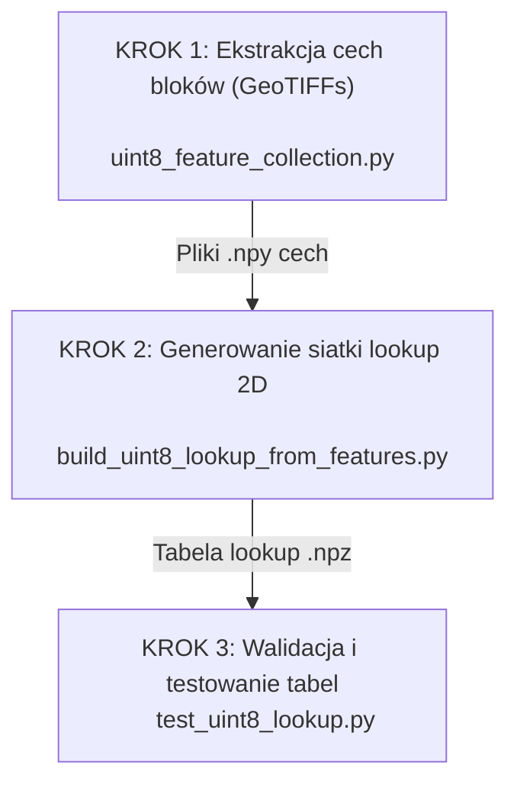
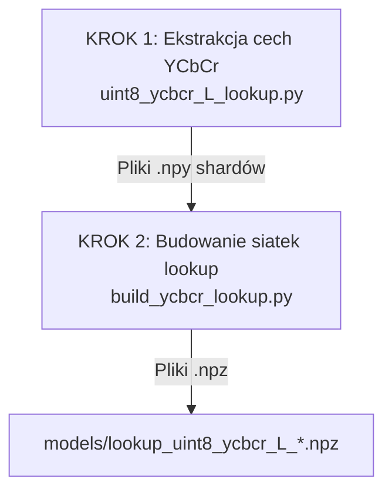

# FIDWAC v2 — Instrukcja Uczenia Modelu Heurystycznego (Advanced Heuristic)

Katalog `research/` zawiera skrypty badawcze służące do ekstrakcji cech z obrazów `uint8` (ortofotomapy), trenowania modeli statystycznych oraz budowania tabel lookup siatki 2D kwantylowej, które są wykorzystywane przez silnik kompresji w trybie zaawansowanej heurystyki (`advanced_heuristic=True`).

---

## 1. Schemat Przepływu Uczenia (Pipeline)

### Pipeline uint8 jednokanałowy (cm=5)



### Pipeline YCbCr / RGB (cm=6)



---

## 2. Opis Kroków i Uruchamianie

### KROK 1: Kolekcjonowanie cech z obrazów treningowych

Skrypt wyciąga z każdego bloku $N \times N$ obrazu GeoTIFF 16 cech matematycznych oraz oblicza rzeczywiste, minimalne $L$ (liczbę współczynników DCT) gwarantujące zadane dokładności (accuracy = 2, 5, 10, 15, 20 px).

*   **Skrypt:** `research/uint8_feature_collection.py`
*   **Jak uruchomić:**
    ```bash
    python3 research/uint8_feature_collection.py collect
    ```
*   **Wejście:** Folder z treningowymi plikami GeoTIFF (zdefiniowany w skrypcie/configu).
*   **Wyjście:** Pliki cech `uint8_features_N{8,16}_sf{1,10}_part*.npy` w katalogu `results/features/`.

Dla trybu RGB (cm=6):

*   **Skrypt:** `research/uint8_ycbcr_L_lookup.py`
*   **Jak uruchomić:**
    ```bash
    python3 research/uint8_ycbcr_L_lookup.py collect \
        --dataset /path/to/dataset \
        --output results/ycbcr_features \
        --block-sizes 8 \
        --scaling-factors 1,10 \
        --accuracies 2,3,5,10,20,30
    ```

---

### KROK 2: Budowanie dwuwymiarowej siatki Lookup (Grid 2D)

Ten skrypt przetwarza wyekstrahowane cechy w sposób strumieniowy (co zapobiega przepełnieniu pamięci RAM przy zbiorach danych sięgających 50 GB) i generuje siatkę 2D na podstawie dwóch najważniejszych cech o najwyższej korelacji: `ac_abs_mean` oraz `zero_ratio`.

*   **Skrypt:** `research/build_uint8_lookup_from_features.py`
*   **Jak uruchomić:**
    ```bash
    python3 research/build_uint8_lookup_from_features.py
    ```
*   **Wejście:** Wygenerowane w Kroku 1 pliki cech `.npy` z folderu `results/features/`.
*   **Wyjście:** Plik tabeli lookup `models/lookup_uint8_grid.npz`.

*Uwaga:* Alternatywny skrypt `research/build_uint8_L_lookup.py` buduje siatki predykcji per-block L (liczby współczynników DCT) dla każdej konfiguracji `(N, sf)`.

Dla trybu RGB (cm=6):

*   **Skrypt:** `research/build_ycbcr_lookup.py`
*   **Jak uruchomić:**
    ```bash
    python3 research/build_ycbcr_lookup.py \
        --features /abs/path/results/ycbcr_features \
        --models /abs/path/models \
        --block-sizes 8 \
        --scaling-factors 1,10 \
        --accuracies 2,3,5,10,20,30 \
        --percentile 90
    ```
*   **Wyjście:** Pliki `models/lookup_uint8_ycbcr_L_N8_sf{1,10}_acc{2,3,5,10,20,30}_grid.npz`

---

### KROK 3: Testowanie i walidacja wygenerowanej tabeli

Skrypt ładuje nowo wygenerowaną tabelę lookup i przeprowadza testy dokładności predykcji, obliczając błąd MAE (Mean Absolute Error) oraz procent bezpiecznych predykcji na zbiorze walidacyjnym.

*   **Skrypt:** `research/test_uint8_lookup.py`
*   **Jak uruchomić:**
    ```bash
    python3 research/test_uint8_lookup.py
    ```
*   **Wejście:** Wygenerowana tabela `.npz` z katalogu `models/`.
*   **Wyjście:** Statystyki MAE, weryfikacja struktury gridu, testy single/batch lookup.

---

## 3. Trening heurystyk

*   **`research/heuristic_uint8_trainer.py`**: Narzędzie do automatycznego doboru progów odchylenia standardowego obrazu (`std_high`, `std_medium`) oraz optymalnego rozmiaru bloku (N) na podstawie analizy statystycznej całych kanałów.
    ```bash
    python3 research/heuristic_uint8_trainer.py collect <dataset_path> [max_files]
    python3 research/heuristic_uint8_trainer.py train <statistics_json>
    ```
*   **`research/heuristic_uint8.py`**: Wygenerowane reguły heurystyczne (auto-generowane przez `heuristic_uint8_trainer.py`).

---

## 4. Gdzie skopiować wyuczony model?

Po pomyślnym zakończeniu uczenia, pliki tabel `.npz` należy umieścić w katalogu modeli zdefiniowanym w `config.json` pod kluczem `directories.models` (domyślnie `./models/`). Silnik kompresora automatycznie załaduje je przy uruchomieniu kompresji z parametrem `advanced_heuristic = true`.

### Nazewnictwo plików modeli

| Plik | Tryb | Opis |
|------|------|------|
| `lookup_uint8_grid.npz` | cm=5 | Główna siatka `(ac_abs_mean, zero_ratio) → (sf, bs)` |
| `lookup_uint8_L_N{8,16}_sf{1,10}_grid.npz` | cm=5 | Siatki predykcji L per-block |
| `lookup_N{8,16}_acc{0.01,0.05,...}_grid.npz` | cm=3 | Siatki dla danych float32 (elevation) |
| `lookup_uint8_ycbcr_L_N8_sf{1,10}_acc{2,3,5,10,20,30}_grid.npz` | cm=6 | Siatki YCbCr dla RGB accuracy |
